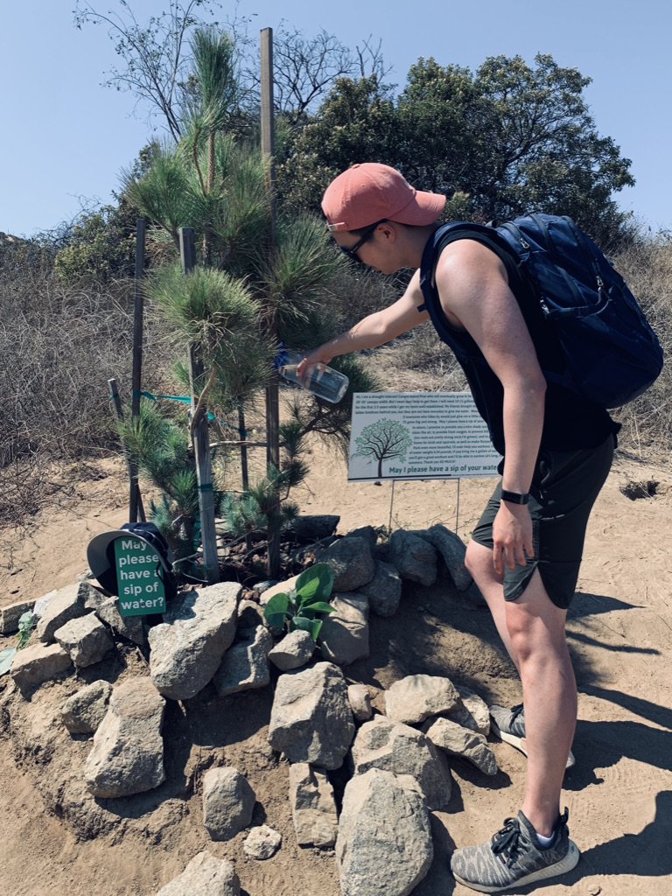

### Recording life, code, and passion.

Hi, I'm Jeff 👋. Welcome to my personal corner of the internet! I created this blog for myself to freely share thoughts and document my progress as a software engineer. I have benefited immensely from the generous and welcoming programming community who share their knowledge with others. I hope to replicate that learning experience for others through this blog!

#### Where am I from?

I was born and raised in **Seoul, South Korea**. Currently, I live in the **Greater Chicago Area**.
  

#### What's my job?

I am currently a student studying computer science at **Northwestern University**. I will be joining **Facebook** as a software engineer after I graduate.
  

#### What kinds of professional experience do I have?

I was previously a software engineering intern at [Facebook](https://www.faebook.com), [Knowru](https://www.knowru.com), [Esri](https://www.esri.com/en-us/home), and [Fumi](https://fumi.co.kr/main/home/home). I worked on the front-end and back-end of various projects, using technologies such as **React.js, Redux, Ember.js, Angular.js, Hack/PHP, Django, Flask, AWS, GraphQL, MySQL, and PostgreSQL**.
  

#### When did I start programming?

My first ever programming experience was in freshman year of college.
  

#### Why do I like to code?

I love to build and create software & products that impact the world in a positive way. It's a great feeling to be able to help others through technology!
  

#### What technologies interest me?

I am still in the process of exploring many different areas of software engineering. So far, I've found passion in delivering high quality end-products to users, as well as the art of crafting beautiful and readable code for us engineers.
I especially enjoying exploring various web technologies. I love how the technologies related to the web are rapidly developing and constantly changing for the better. I'm also developing a passion for scalable software systems and the infrastructure work that supports products used world-wide by millions.
