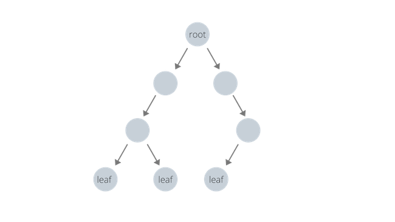
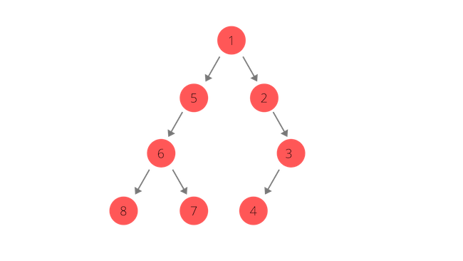
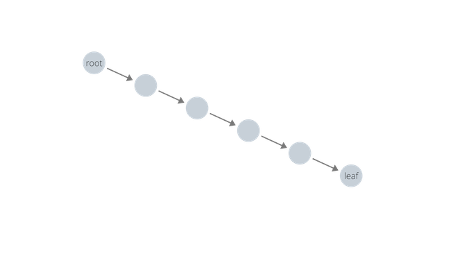

This is the second post of the algorithms series, and this time I would like to share a classic algorithms problem related to binary trees. In this post, we are going to examine how to check if a binary tree is balanced.  

**Problem Statement:** Write a function that takes a root node of a tree as an input, and returns whether or not the tree is balanced. A balanced tree satisfies the following condition: the difference between depths of any two leaf nodes must be no greater than 1.  

**Problem Source**: Leetcode - [Balanced Binary Tree](https://leetcode.com/problems/balanced-binary-tree/)  

The problem statement itself may not paint a clear picture of what we are dealing with, so let us take a look at the following picture of a balanced binary tree. Notice that the depth of all leaf nodes differ by at most 1. 



Hopefully, the picture above was enough to give you a clear idea of what a balanced binary tree looks like. Now, let's dive into solving the problem! We’ll go through it step by step.  

## 1. We are interested in the *depth* of leaf nodes - nodes that don't have any child node

At the end, we need to somehow keep track of the depth of the leaf nodes to determine if the tree is balanced. There can be different ways to approaching this problem at hand. I'm going to be implementing an iterative depth-first traversal of the tree to check the depth of leaf nodes.  

To visualize depth-first traversal, take a look at the following diagram:



## 2. Do we necessarily have to traverse the *entire* tree, and check *all* the leaf nodes to definitively determine if a tree is balanced?  

Well, it *depends*. If a tree is in fact balanced, we will end up traversing the entire tree in *all* cases. There's no escaping that. However, if a tree is not balanced, we can optimize our code so that we can just return `False` as soon as we figure out that there exists a leaf node that is more than a level deeper in depth than another leaf node.  

Taking these points into consideration, let's think about how we are going to solve the problem.

The general idea is as follows:

* Perform a depth-first traversal of the tree
* As we traverse the tree, check if we are at a leaf node
* If the node is a leaf node, check its depth, return `False` if leaf node is bad
* If the node is not a leaf node, just add its children to stack
* At the end of the traversal, return `True` if we still haven't found any problems

Now let's try coding it out!  
The fully working code written in Python is as follows:

```python
def check_balanced(root):
    #an empty tree is balanced!
    if root is None: return True
    #this will be our auxiliary stack
    nodes = []
    #list to keep track of depth
    depths = []
    nodes.append((root, 0))

    while len(nodes) > 0:
        currnode, currdepth = nodes.pop()
        #we found a leaf node!
        if not currnode.left and not currnode.right:
            if currdepth not in depths: 
                depths.append(currdepth)
                #this is where we optimize our algorithm
                #the first condition implies that we have depths other than 1 or 0
                #the second condition implies that we have two different depths
                #that have a greater difference than 1
                if len(depths) > 2 or\
                   (len(depths) == 2 and abs(depths[0] - depths[1]) > 1):
                   return False
        #if it's not a leaf node, keep traversing 
        else:
            if currnode.left: 
                nodes.append(currnode.left, currdepth + 1)
            if currnode.right: 
                nodes.append(currnode.right, currdepth + 1)

    #if we haven't had an issue this far, it's safe to return True!
    return True
```

**Time Complexity**: O(n)  
*Explanation:* Worst case, we are going to have to traverse through the entire tree, which has *n* nodes.

**Space Complexity**: O(n)  
*Explanation:* It's possible to think our algorithm yields a space complexity of O(log n), since our auxiliary stack will have at most an entire path of nodes from root to leaf in it. The latter part is correct: our auxiliary stack will have at most an entire path of nodes from root to leaf node. But, a binary tree doesn't necessarily guarantee that it will in fact look like a *tree*. In the worst case where the tree is completely skewed, we can effectively have a data structure that is no different from a linked list. In that case, our stack will grow to a size proportionate to the size of the enitre tree. So in the worst case, our space complexity is O(n).  

This diagram of a skewed tree will help your understanding:  



And with that, we are done! Hopefully this post gave you a clear idea of how to determine if a binary tree is balanced, and how efficient our algorithm is in terms of time and memory.