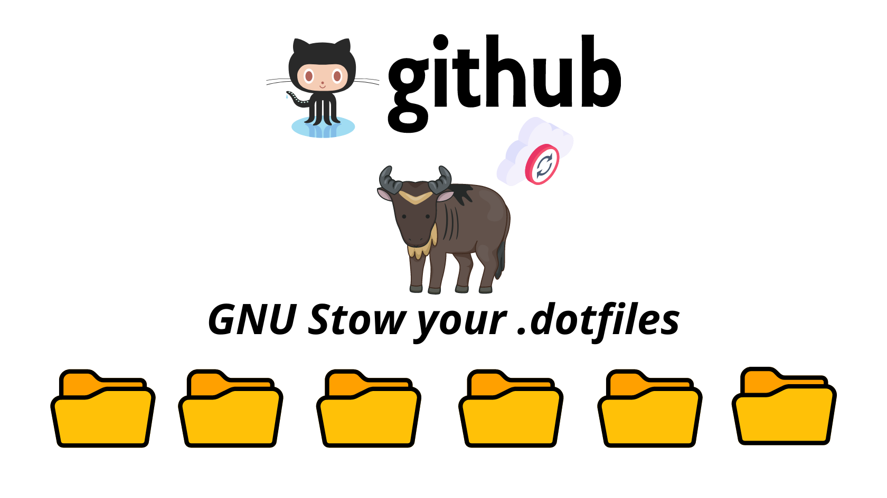

I recently stumbled across a problem that I never really had to solve before. As I started my first full-time job, I received a new laptop for work-related use. I also set up my development server, which is a remote computer sitting somewhere in a data center that I can SSH into for development purposes. As my preferred choice of text editor is Neovim, I have a lot of configuration files that go along with it. I also have some custom tmux configurations. What about ZSH configurations? The list goes on. One way of doing it would be to manually copy-and-paste all the configuration files. But there had to be a better way - one that doesn't require so much error-prone manual reptition. If I start a new job at a different company, or if I get a new personal computer for myself, I don't want to have to continue to copy-and-paste all these "dotfiles". So I searched for a way to make my dotfiles "portable". The solution that I decided to go with was [GNU Stow](https://www.gnu.org/software/stow/) - in this post I'll explain a little bit about how Stow works.

## What is GNU Stow ?
*Following is taken from the GNU Stow official website.*  
GNU Stow is a symlink farm manager which takes distinct packages of software and/or data located in separate directories on the filesystem, and makes them appear to be installed in the same place. For example, `/usr/local/bin` could contain symlinks to files within `/usr/local/stow/emacs/bin`, `/usr/local/stow/perl/bin` etc.

## How it works
What makes GNU Stow so great is that it makes symlinking the config files a breeze. This makes it possible to simply have all of your dotfiles in a single VCS (Version Control Software) repository, whereever that may be in your machine. Let's go over it step-by-step and see how it works. 

#### 1. Create a `.dotfiles` directory
In your home directory (not a requirement to be in your home directory, but this is how most people choose to do it), create a `.dotfiles` directory.

```bash
$ pwd
/Users/jeffyang

$ mkdir .dotfiles && cd .dotfiles
```

#### 2. Create subdirectories for all the programs you want to configure through dotfiles 
Now that we have a `.dotfiles` directory, we need to put create subdirectories for all the programs that we want to configure and manage with Stow. In this example, I'll go ahead and create three subdirectories for `nvim`, and `zsh`.

```bash
$ pwd
/Users/jeffyang/.dotfiles

$ mkdir nvim zsh

$ tree
.
├── nvim
└── zsh
```

For each of the subdirectories we created, Stow will see these as individual worlds. Inside each of the subdirectories that we just created, we need to make sure that we maintain the exact same structure as home directory. For Stow, the directory structures we create for each of the subdirectories `nvim`, and `zsh` will be the symlink paths that it will create. Let me show you exactly what I mean through real examples.

For `nvim`, the configuration files would usually live in my home directory under `{$HOME}/.config/nvim`. For Stow to know exactly where to symlink the dotfiles to, we need to emulate this exact path.

```bash
$ pwd 
/Users/jeffyang/.dotfiles/nvim

$ tree
.
└── .config
    └── nvim
        ├── autoload
        │   └── plug.vim
        ├── init.vim
        ├── lua
        │   └── jeffyang
        │       ├── colors.lua
        │       ├── git-signs.lua
        │       ├── keymap.lua
        │       ├── lsp-config.lua
        │       ├── lua-line.lua
        │       ├── meta-lsp-config.lua
        │       ├── null-ls.lua
        │       ├── nvim-cmp.lua
        │       ├── telescope.lua
        │       └── utils.lua
        └── plugins
            ├── base.vim
            ├── neoformat.vim
            ├── nerdtree.vim
            ├── tabline.vim
            └── telescope.vim
```

The specific organization of my nvim config files are unimportant - what's important to note here is that inside the `nvim` subdirectory we just created, I have `.config/nvim/` which contains `init.vim`. This way, Stow can symlink the files under the `nvim` subdirectory correctly. 

Let's try another example with `zsh`. This will be a bit simpler, because ZSH configuration files typically live in `{$HOME}/.zshrc`. We'll create this exact structure for Stow.

```bash
$ pwd 
/Users/jeffyang/.dotfiles/zsh

$ tree
.
└── .zshrc
```

Hopefully now you can see the pattern - the key is to keep the directory structure exactly the same as you would normally under your home directory. Now, let's see how to *actually* use Stow to create the symlinks so that the configuration files all work as expected.

#### 3. Stow'em all!
This is arguably the easiest part. 

```bash
$ cd ~/.dotfiles
$ pwd
/Users/jeffyang/.dotfiles
$ stow nvim 
$ stow zsh
```

That's it! Stow will create all the symlinks needed to ensure that your configuration files for all the programs that you want to mangae *just work*.

## Conclusion
What's so great about Stow is that you can keep *all* of your dotfiles in a single VCS repository. You can then push it up to Github or any other VCS cloud provider of your choice. Any time you want to set up your configuration files for the programs you care about, you simply need to download them from the cloud, and Stow them. As a software developer, I can't appreciate Stow enough for finally bringing all my dotfiles under control :) 

