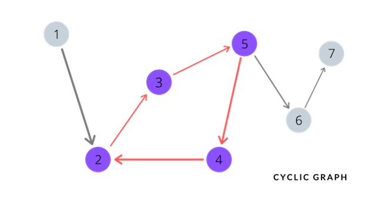

This is the third post of the algorithms series, and this time I would like to share a classic algorithms problem related to graphs. In this post, we are going to examine how to detect a cycle in a directed graph.

I specifically chose to write a blog post about this problem because it personally gave me lots to think about. First and foremost, the problem statement is very delicately worded so that it doesn't expose its face to the game players from the get-go. Additionally, as most graph algorithms do, this problem covers a couple of very important computer science fundamentals. Lastly, the final solution that we will take a look at demonstrates the importance of writing clean code. It's a highly opinionated statement, but I believe modularized code is much more readable and maintainable (especially as code becomes longer), and will do wonders when trying to debug. Granted, some of these "interview questions" aren't always going to be about writing clean and beautiful code as much as they are about getting an efficient solution. Regardless, it's never bad to get into the habit of writing high quality code whenever you can! Now, let's take a look at the problem.

**Problem Statement:** There are a total of *n* courses you have to take, labeled from *0* to *n-1*. Some courses may have prerequisites, for example to take course *0* you have to first take course *1*, which is expressed as a pair: *[0,1]*. Given the total number of courses and a list of prerequisite pairs, is it possible for you to finish all courses? (There are no duplicate edges in the input prerequisites)

**Problem Source**: LeetCode - [Course Schedule](https://leetcode.com/problems/course-schedule/)

**Examples:**
```text
Input: 2, [[1,0]]
Output: True
Explanation: There are a total of 2 courses to take.
To take course 1 you should have finished course 0. So it is possible.

Input: 2, [[1,0],[0,1]]
Output: False
Explanation: There are a total of 2 courses to take.
To take course 1 you should have finished course 0, and to take course 0 you should
also have finished course 1. So it is impossible.
```

**Dissecting the Problem**: We first need to completely *understand* the problem before we can go on to code. This problem can essentially be reduced to a graph problem, where given a list representation of all edges of a *directed* graph, we need to figure out whether or not the given graph contains a cycle. Carefully take a look at the problem. The graph produced by the given list representation is a *directed* graph, because there exists direction in the edges: *[1,0]* and *[0,1]* represent 2 different edges. The only case where it would be impossible to take *n* courses is when there are 2 or more subjects that are prerequisites of each other. Note that this does not mean that the two subjects (represented as vertices in a graph) necessarily need to have two edges of opposite directions between each other. If there is a *path* that one can follow from *a* to *b* and back to *a*, we can conclude that it is impossible to complete such set of subjects.

## Visualizing a Cycle
Before we dive into trying to solve the problem, it's important to first go over the key concept in this problem, which is to identify a *cycle* in a graph. Let's first take a look at an *acyclic* graph, which is a graph that does not have any cycles.


As we can see in the graph presented above, we say that a graph is *acyclic* when from any ambiguous node of the graph, it is impossible to get back to itself by following the directed edges. Now, let's take a look at a directed *cyclic* graph.



Notice how the graph presented above differs from the acyclic graph in that nodes 2, 3, 4, and 5 are all connected by directed edges, making it possible to traverse back to itself by simply following the given edges. Hence, this is an example of a directed *cyclic* graph.

## Graph Representation
To solve this problem effectively, it is important to know how graphs are typically represented. Graphs are usually represented with either an *adjacency list* or an *adjacency matrix*. One could advocate for either of these representations depending on the situation, but the adjacency list represenation is generally more popular because it is more space efficient when dealing with a sparse graph. When solving this problem, I decided to use a dictionary implementation of the adjacency list, because it offers a very compact representation of the graph, and is very easy to see which vertices are connected to which. Let's take a look at an example.

An adjacency list implemented with dictionary (for the cyclic graph presented above):

```text
graph = {
    1: [2]
    2: [3]
    3: [5]
    4: [2]
    5: [4, 6]
    6: [7]
    7: []
}
```

It is very simple to represent a directed graph as an adjacency list, and once we have the representation like the one above, it is easy to see which vertices are connected to which. Note that the keys of the dictionary `graph` represent the vertices, and the corresponding values represent the reachable vertices that are only a single edge away.

At the end, we need to some how keep track of the depth of the leaf nodes to determine if the tree is balanced. There can be different ways to approaching this problem at hand. I'm going to be implementing an iterative depth-first traversal of the tree to check the depth of leaf nodes.

## Solution
Now that we have a firm understanding of the representation of a graph, we can move on to solving the problem. If you lost track of the problem statement, feel free to scroll up and take a look again right now.

There are lots of different ways to tackle the problem at hand. Essentially, any algorithm that can detect a cycle in a directed graph is a working solution for this particular problem. There are lots of different known ways to detect a cycle in a directed graph: depth first search, breadth first search, graph coloring, topological sort, and using a UnionFind data structure are some of the possible ways, just to name a few. I'm going to be solving this problem by utilizing the depth first search algorithm to traverse the graph. Why? It's arguably the simplest way (without compromising efficiency)!

The general idea is as follows:

* Generate an adjacency list (dictionary represenation) from the list of edges given as input
* For each node in the adjacency list, check to see if there's a cycle (Note: it's important to loop through each of the nodes to make sure we are getting full coverage of the graph. Think about edge cases such as disconnected graphs, or graphs where a vertex doesn't have any neighbors coming out of it)
* If there is a cycle detected, short circuit and return `False`. If the loop terminates without detecting a cycle, return `True` (remember, we can complete the courses if and only if there are no cycles in the graph)

Now let's try coding it out!
The fully working code written in Python is as follows:
```python
class Solution:
    #this is the main method that will give us the solution
    def can_finish_courses(self, num_courses, prerequisites):
        visited = [False] * num_courses
        visiting = [False] * num_courses
        input_graph = self.represent_as_graph(num_courses, prerequisites)
        all_nodes = list(input_graph.keys())[0]

        #we need this loop to make sure we keep all vertices in the picture
        for node in all_nodes:
            if self.is_cycle(input_graph, node, visited, visiting) is True:
                return False

        #if loop terminates without detecting a cycle, we can safely return True
        return True

    #this method generates an adjacency list from the input list
    def represent_as_graph(self, length, list):
        adjacency = {}

        for i in range(n):
            adjacency[i] = []

        for prereq in prerequisites:
            node = prereq[0]
            adj = prereq[1]

            adjacency[node].append(adj)

        return adjacency

    #this method detects cycle in a graph by depth first traversal
    def is_cycle(self, graph, node, visited, visiting):
        visited[node] = True
        visiting[node] = True

        for neighbor in graph[node]:
            if visited[neighbor] is False:
                if self.is_cycle(graph, neighbor, visited, visiting) is True:
                    return True

           #if node is visited and is in visiting
            elif visiting[neighbor] is True:
                return True

        #if we are finished exploring this node
        visiting[node] = False
        return False
```

**Time Complexity**: O(V+E)
*Explanation:* Worst case, we are going to have to traverse through the entire graph, which has *V* vertices. That's what accounts for the O(V) part of the time complexity O(V+E). Additionally, due to the adjacency list representation of a graph, for each node, our algorithm traverses the list of neighbors to find the adjacent neighbors. Say, we have *E* edges in the graph. Then, our algorithm is going to take O(E) additional time to find the neighbors for each of the vertices. At the end, this totals to O(V+E) time complexity.

**Space Complexity**: O(V)
*Explanation:* The space complexity of our solution is a bit tricky. The amount of memory we need to run our solution depends on both memory allocated for explicitly declared auxiliary data structures and the memory usage incurred by using a recursive algorithm for our depth first search. Let's first take a look at how much memory space we need for the data structures we are using. We explicity declared the variables `visited`, `visiting`, `input_graph`, and `all_nodes` and assigned them as either a list or a dictionary. Note that the size of these data structures all depend on the `num_courses` input, which is essentially the number of vertices in our graph. So for all of the auxiliary data structures we are using, they are all bounded by O(V) space complexity where *V* is the number of vertices in the graph. Now let's take a look at the recursive depth first traversal algorithm we have implemented. Worst case, the memory stack will need to hold up to *M* function calls, where *M* is the length of the longest path. Note that *M* is equal to *V-1* because when traversing a graph that does not allow for repetition, the longest path will have at most *V-1* edges, where *V* is the number of vertices. The worst case space complexity then, can be denoted as the following: O(V) + O(V-1) = O(V).

## Conclusion
I thought that this problem was great in reinforcing some very important, yet fundamental concepts. In the particular approach I took with my solution, we were able to cover the depth first traversal algorithm of a graph. If we were to try and solve this problem in many different ways, we could have covered other important algorithms such as breadth first search of a graph, graph coloring, and topological sort. Also, notice how I wrote my solution out. I wrote helper methods in the `Solution` class to make sure I keep my code *clean* and *modular*. Although the reasons for writing code this way may not be very apparent here, tidy code will save so much time and effort as code becomes longer and more complicated. If you have the time, make sure to try and write different solutions to this problem by taking a different approach!
