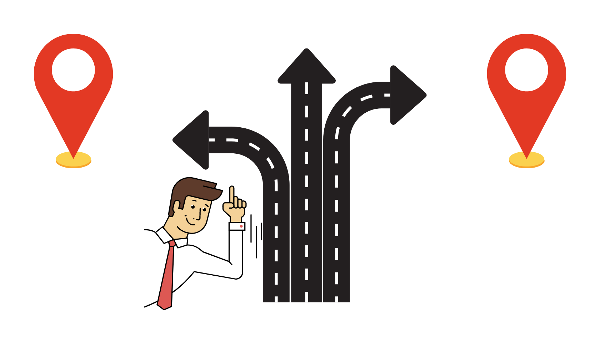
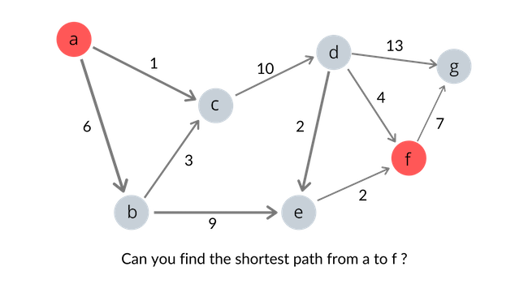
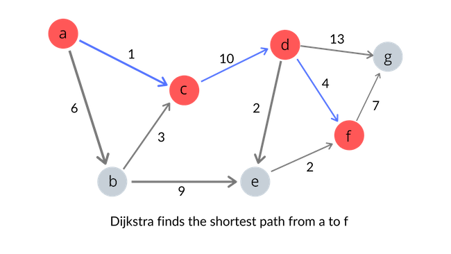
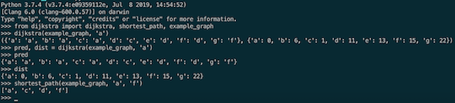

In this post, I would like to take a slightly different approach and write about an algorithm that I learned about in a classroom setting. While taking a computer science course in data structures and algorithms this quarter, I found the graph data structure and related algorithms to be particularly fascinating, as graphs can be applied in real-life to represent virtually anything from friendships to geographic maps. Although far from being an expert on this topic, I am going to make an attempt to dissect perhaps the most famous graph algorithm and its practical application. Take a bow, introducing Dijkstra's algorithm and the single source shortest path problem.  

## 1. Single Source Shortest Path 
Before we talk about the algorithm itself, let's first get a sense of what Dijkstra's algorithm is all about; what significant questions can Dijkstra's famous algorithm answer? Often referred to as the "Single source shortest path" problem, Dijkstra's algorithm is suitable for finding the shortest distance from a single vertex to all other vertices. Using the results Dijkstra's algorithm produces, we can also find the shortest path from a single vertex to a specific destination, say, vertex *f*.   



The graph illustrated above might have you think "It doesn't seem that hard to manually find the shortest path from vertex *a* to *f* !" If that's the case, imagine a graph with hundreds of vertices and edges; would you still be willing to manually find the shortest path from *a* to *f* ? It would be possible, but extremely time-consuming. This is where Dijkstra's algorithm comes into play. With some help from Dijkstra, we can find the shortest path from a single vertex to every other *reachable* vertex in the graph, with relative ease.  

## 2. Dijkstra's Algorithm 
Finally, we can start our dissection of Dijkstra's algorithm. If we simply try to memorize the code for the algorithm line by line, it will be difficult (at least for people with non-photographic memory, like me). The better approach would be to try and understand what repeated steps the algorithm goes through until it finishes processing the graph and returns. The following are the steps that Dijkstra's algorithm follows, until it exhausts the entire vertex set of a graph: 

1. When selecting the next node to visit, decision should be made based on the **known distance**  

2. For each node we visit, we check the neighboring nodes (i.e. the nodes that are 1 edge away from the node we are currently visiting)  

3. When checking the neighboring nodes, calculate the distance traveled so far (distance from the starting node to the current node) + distance to the neighboring node from the current node  

4. If the calculation done above is **less than** the known distance to the neighboring node, update the distance information for that neighboring node  

(Note: Steps 3 - 4 are known as the *relaxation* of vertices)  

In the implementation of the algorithm, I will be using Python's `heapq` module, which conveniently lets us use a priority queue to ensure that the nodes are relaxed in the correct order (minimum distance nodes first!). Also, note that I will be using an adjacency list representation of graphs, implemented with Python's dictionary. With the steps specified above in mind, let's take a look at the following implementaion of Dijkstra's algorithm:

```python
#python implementation of Dijkstra's algorithm using priority queue 
import heapq 

def dijkstra(graph, source):
    dist = { vertex: float("inf") for vertex in graph }
    pred = { vertex: -1  for vertex in graph }
    visited = { vertex: False for vertex in graph }
    
    dist[source] = 0
    pred[source] = source
    todo = [(0, source)]
    
    #repeat the process until nodes are exhausted
    while len(todo) > 0:
    	#select the node with minimum known distance
        curr_distance, curr_vertex = heapq.heappop(todo)
        
        #if vertex has already been visited, skip it
        if visited[curr_vertex]: continue

        #if vertex has not been visited do the follwing
        visited[curr_vertex] = True
        
        #check the neighbors of the current node
        for neighbor, weight in graph[curr_vertex].items():
        	#update if following condition is satisfied
            if curr_distance + weight < dist[neighbor]:
                dist[neighbor] = curr_distance + weight
                #keep track of previous node : we need it to find shortest path
                pred[neighbor] = curr_vertex
                heapq.heappush(todo, (curr_distance + weight, neighbor))
    #result packages dist and pred in a tuple       
    return (pred, dist)
```

Dijkstra's algorithm implemented as above does not directly give us the shortest path between two vertices. However, it does produce two valuable pieces of information, one of which can be carefully crafted to give us the *shortest path* between two vertices. Notice how the `dijkstra` function above returns a tuple containing `pred` and `dist`. The `pred` dictionary contains information on what node was visited before visiting each of the vertices while traversing the graph. The `dist` dictionary contains information on the distance from the starting point to each of the vertices in the graph. By working our way backwards in the `pred` dictionary, starting from the destination until we reach the starting point, it is possible to identify the *shortest path* from the source to destination. We will need the help of a stack to get the order correct. 

```python
def shortest_path(graph, source, destination): 
	#retrieve the pred dictionary from dijkstra
	pred = dijkstra(graph, source)[0]
	#we need a stack to reverse the order 
	stack = [destination]
	#we will return the shortest path as a list
	shortest_path = []

	while True:
		curr = stack[-1] 
		before = pred[curr]
		
		#source and destination are disconnected
		if before == -1: 
			return "there is no path!"
		
		#we have reached the source node by traversing backwards
		if before == source: 
			stack.append(before)
			break
		
		stack.append(before)

	#reverse the order: source --> destination 
	while stack: 
		shortest_path.append(stack.pop())

	return shortest_path

#example graph to test dijkstra's algorithm
example_graph = {
    'a': {'b': 6, 'c': 1},
    'b': {'c': 3, 'e': 9},
    'c': {'d': 10},
    'd': {'e': 2, 'f': 4, 'g': 13},
    'e': {'f': 2},
    'f': {'g': 7},
    'g': {}
}
```

With the `shortest_path` function, we can now find the shortest path from a source node to a destination node. Note that Dijkstra's algorithm is not capable of finding the distance/shortest path between two nodes that are not connected.



The following is the result of running `dijkstra` and `shortest_path` functions inside my Python shell with the example graph provided above. Note that the `example_graph` provided in the code is an adjacency list representation of the graph shown above, but is implemented with a Python dictionary. 



## 3. Limitations of Dijkstra's Algorithm 
The Dijkstra's algorithm is not bullet proof, however. The most remarkable limitation of Dijkstra's algorithm is that it will not work as expected if there are negative edges in a graph. In order to find the shortest distance from one starting vertex to all connected vertices, Dijkstra relies on the fact that if all edges are non-negative, it is always true that adding an edge will never make a path shorter. Only when such an assumption can safely be made can Dijkstra's "greedy" approach to the problem remain intact with solving global optimality. If negative edges are introduced and such an assumption is no longer valid, Dijkstra's method of selecting a node with minimum known distance at each iteration will no longer guarantee a correct outcome. To overcome such limitations of Dijkstra's algorithm, we can use other algorithms such as the Bellman-Ford's algorithm and the Floyd-Warshall's algorithm, as needed. These may be subject to discussion in future posts.  

## 4. Conclusion
Hopefully this blog post helped you gain a solid understanding of Dijkstra's algorithm and the single source shortest path problem. If there is anyone reading this post who is interested in learning the mathematical proof on the correctness of Dijkstra's famous algorithm, I found [this](https://web.engr.oregonstate.edu/~glencora/wiki/uploads/dijkstra-proof.pdf) helpful. 