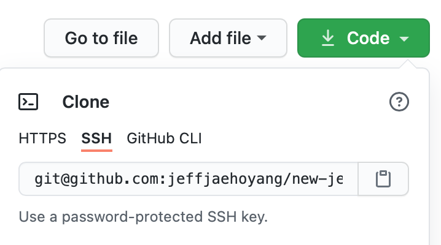

This blog post is meant to serve as a kind note for my future self, inevitably struggling to properly setup Github SSH authentication.
If there's anyone else out there who happens to stumble upon this post while struggling with the same issue, hopefully this post will help you out.
I will go over **what** SSH authentication is, **why** you might be interested in setting one up yourself (in the context of Github), and finally, **how** to set it up properly.

## What is SSH ?
SSH stands for **S**ecure **Sh**ell, and is a cryptographic network protocol for establishing trustworthy and secure network operations over an unsecured public network such as the internet.
Explaining the details of how exactly SSH works behind the scenes is not within the scope of this blog post, so I'll keep this explanation at a high-level overview. 
SSH Authentication is generally implemented via a classic client-server model, where the connection between the client and server is initiated by an SSH client making a connection request.
The server, upon receiving a connection request from a client, sends a public key over to the SSH client, starting a process well known as **public key cryptography**
(if you are not familiar with it, and would like to learn more about it in depth, feel free to check [this](https://ssd.eff.org/en/module/deep-dive-end-end-encryption-how-do-public-key-encryption-systems-work) link out).
Once the SSH client and SSH server agree that each other can be trusted, the two establish a communication channel in which data is **encrypted**, making it **secure**.


## Why Use SSH for Github ?
There are two different ways to interact with remote github repositories (clone, pull, push, etc): **HTTPS and SSH**.



HTTPS is a very popular option for a lot of Github users, because it is extremely simple. In fact, *Github also recommends* HTTPS over SSH due to its port (443) being globally accessible, 
even behind firewalls. If you opt for HTTPS, all you need is your Github account information (id / password). However, when interacting with remote repositories, **you will be prompted to enter your Github credentials every time**
(yes, even if you cache your credentials somewhere, it is still being sent over the network for authentication).
This is where I see the comparative advantage of setting up SSH for authentication. Using HTTPS exposes your Github account credentials in some way, shape, or form. 
If your account information is compromised, you may be locked out of all your repositories and your account itself. That can be a real disaster.

On the other hand, if you opt for SSH, **you do not have to enter your Github credentials at all**. It is more secure in the sense that you do not expose your Github account. 
However, in order to set up SSH on your local machine, you do have to create a public/private key, add the private key to your ssh-agent, and copy the public key to your Github account.
This way, Github can verify that it is indeed *you* that is trying to interact with Github. Let's take a look at how to set all this up!

## How to Set up SSH for Github 

### Generate a Key Pair

The first step in the process is to generate a public-private key pair. Use the `ssh-keygen` command to generate your keys.

```bash
$ ssh-keygen -t ed25519 -C "youremailaddress@example.com"
```

You will have been prompted for a location to store your SSH keys, and I'll leave that up to you. As a note, the default location is `~/.ssh`.
The `ssh-keygen` command should also have prompted you to enter a passphrase. It's up to you to add a passphrase or not, but for security purposes, I would highly recommend using one.
Now, check if your keys have been properly generated: 

```bash
$ cd ~/.ssh # or wherever you specified your keys to be saved
$ ls
id_ed25519      id_ed25519.pub
```

Now start the ssh-agent in the background: 

```bash
$ eval "$(ssh-agent -s)"
```

Now it's time to add the config file for SSH: 

```bash
$ vim ~/.ssh/config
# add the following in the config file and save
Host *
  AddKeysToAgent yes # automatically load keys to agent
  UseKeychain yes # store passphrases in keychain
  IdentityFile ~/.ssh/id_ed25519 # or wherever you specified your keys to be saved
```

Finally, add your SSH private key to the ssh-agent and store your passphrase in the keychain.

```bash
$ ssh-add -K ~/.ssh/id_ed25519
```

That's it! You now have successfully set up your local machine. But we still need to copy the public key that we've generated to Github.
Run the following command to copy the content of your public key file on your clipboard:

```bash
$ pbcopy < ~/.ssh/id_rsa.pub
```

Now, head over to your `Github account > Settings > SSH and GPG keys`. Click on "New SSH Key".
Enter the title of your SSH key (try to be descriptive, just in case you add more SSH keys later on), and copy the public key content from your clipboard.


You should see that your public key is now added to your Github account. You are all set now!

### SSH Port Connection

After following all the steps from above, everything should be working fine. But as with everything else, there's a *caveat*.
Your SSH connection will **default to port 22**, which is the standard port number for SSH. However, unlike HTTPS, certain firewalls or networks 
may be blocking that port, in which case your SSH connection will hang. Fortunately, there is a workaround. We can simply configure SSH to establish connection 
on **port 443**, which is the default port for HTTPS.

```bash
$ vim ~/.ssh/config
# we already added this part before
Host *
  AddKeysToAgent yes # automatically load keys to agent
  UseKeychain yes # store passphrases in keychain
  IdentityFile ~/.ssh/id_ed25519 # or wherever you specified your keys to be saved

# TODO : set github ssh connection to port 443
Host github.com
  Hostname ssh.github.com
  Port 443
```

Now your SSH setup with Github should really be working!