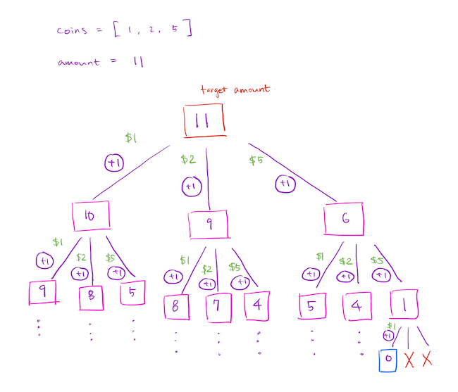
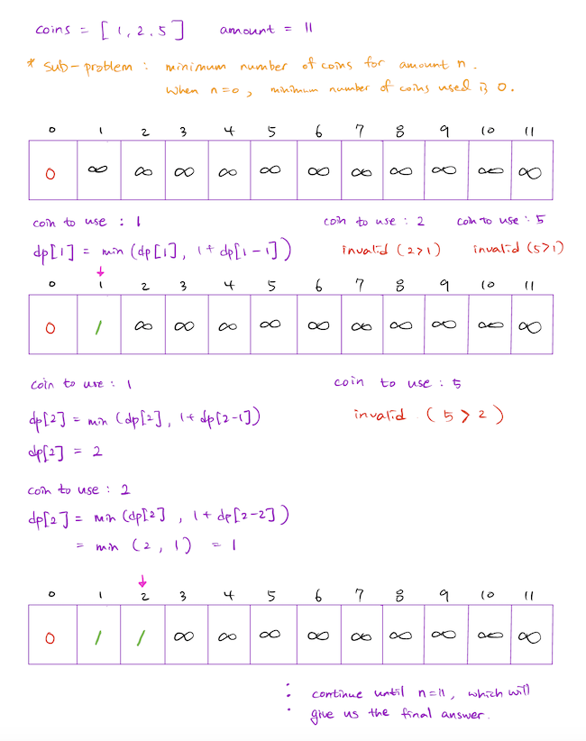

In this post, I am going to attempt to dissect the popular *coin exchange* problem that can be found on many technical interview preparation resources (e.g. LeetCode).

**Problem Statement:** You are given coins of different denominations and a total amount of money amount. Write a function to compute the fewest number of coins that you need to make up that amount. If that amount of money cannot be made up by any combination of the coins, return `-1`.

**Problem Source**: LeetCode - [Coin Change](https://leetcode.com/problems/coin-change/)

**Examples:**

```text
Input: target = 11, coins = [1, 2, 5]
Output: 3
Explanation: 11 = 5 + 5 + 1

Input: target = 3, coins = [2]
Output: -1
```

**Dissecting the Problem**: This particular question is deceivingly simple. In fact, it used to be a problem that we all had to solve on a daily basis back in the days when paying in cash was mainstream. For example, if you had to pay $35 at a restaurant and you had $1, $5, $10, $20 coins, what combinations of coins would you use to pay? Obviously, in real life, paying with the minimum number of coins wouldn't always be your goal. For this problem, however, let us pretend that paying with the minimum number of coins is always our goal. What would be our strategy then? Most people will be tempted to follow a *greedy* approach, which dictates that we simply select the highest value coin at every step. The problem is that the greedy approach will not guarantee that the selected coins will sum up to the target amount. It turns out that there actually isn't a simple strategy/pattern we can follow to come up with the correct solution. What can we do then? Well, we could try *every combination* of coins, and see which combination leaves us with the minimum number of coins. Depending on which coin we select, we will need to subtract that coin's value from the target amount in order to ensure that we incrementally edge towards the final goal. With that in mind, let's take a deep dive into actually coding out the solution!

## Naive Recursive Approach

Our first attempt at solving the problem will not necessarily be perfect. The idea is to come up with a working solution, without complicated optimizations. For me, the most intuitive approach was to go with a recursive algorithm, repeatedly searching for possible coins to add to the current combination of coins that we are building up. Take a look at the following diagram for a clearer visualization of what that means.



The diagram does not illustrate the entire recursive tree, but I hope it is enough for you to see and realize the pattern. Essentially, what it's doing is to try adding each of the possible coin denominations, and add `1` to the `curr_length` as the recursion goes deeper to the next recursive step. If the value of coin is higher than `curr_target`, we simply skip and continue (for example, you cannot make a $4 change with a $5 coin)! Of course, we need to remember to subtract the value of the selected coin from the `curr_target` when continuing down the recursive tree. Once `curr_target` reaches `0`, we know that we are done for that particular coin combination. Now let's take a look at the naive recursive algorithm.

```python
def min_number_coin_change_naive(target, coins):
    # naive recursion
    result = recursion_helper(target, coins)
    return result if result != float("inf") else -1

def recursion_helper(curr_target, coins):
    if curr_target == 0:
        return 0
    overall_min = float("inf")
    for coin in coins:
        if curr_target >= coin:
            new_target = curr_target - coin
            curr_length = 1 + recursion_helper(new_target, coins)
            if curr_length < overall_min:
                overall_min = curr_length
    return overall_min
```

The recursive algorithm is quite straightforward, nothing too complicated. As shown in the diagram above, the algorithm finds the minimum number of coins required for a target amount by going through all possible valid combinations, while keeping track of the overall minimum. This naive recursive approach works, but is prohibitively slow and expensive. Why? Because it is not smart enough to realize that it is being forced to calculate the result of the same calculations over and over again. We can certainly do better.

## Memoization (Top-Down Approach)

With just a few tweaks, we can turn the naive recursive algorithm implemented above into a *smart* recursive algorithm. People like to call the optimization technique we are about to explore *memoization*. Simply put, memoization is nothing but a caching of previous results so that our algorithm remembers what calculations it has already done. If the result is already in the cache, no need for any further calculations; simply return the cached result. If not, proceed with the calculation and add it to the cache. Simple enough, right?


The diagram above illustrates all the repetitive calculations that the naive recursive algorithm had to make in order to produce the final result. Note how all the nodes circled in orange are repetitive calculations. If the recursion tree had a higher branching factor (e.g. more denominations of coins) and a higher target amount, it would have had a lot more repetitive calculations, hence a *prohibitively* slow and expensive algorithm. In the solution below, we simply add a memoization table so that our algorithm can check in the table first before proceeding to calculating the results. The performance gain from this optimization is immense, as we will see for ourselves later.

```python
def min_number_coin_change_memo(target, coins):
    # top-down approach (memoization)
    result = memo_helper(target, coins, memo={})
    return result if result != float("inf") else -1

def memo_helper(curr_target, coins, memo):
    if curr_target == 0:
        return 0
    # first check the cache
    if memo.get(curr_target):
        return memo[curr_target]
    overall_min = float("inf")
    for coin in coins:
        if curr_target >= coin:
            new_target = curr_target - coin
            curr_min = 1 + memo_helper(new_target, coins, memo)
            if memo.get(curr_target): # update cache
                memo[curr_target] = min(memo[curr_target], curr_min)
            else: # add to cache
                memo[curr_target] = curr_min
            if curr_min < overall_min:
                overall_min = curr_min
    return overall_min
```

I hope the algorithm implemented above was fairly easy to understand. Just remember that memoization is nothing but an optimization technique that *caches previous results* in order to enhance the overall performance of the algorithm.

## Bottom-Up Approach

We have looked at two different recursive solutions so far. It turns out that there is another way to approach the problem. Instead of building the solution from the top (i.e. starting with the end target number), we can start building up the solution from the bottom (i.e. starting with a target number of 0). The idea is to build an array starting from 0 and iterate up until the target number, where `array[n]` represents the minimum number of coins needed to make change for the amount `n`. If you have developed a solid understanding of the recursive solutions above, you will realize that the bottom-up approach really isn't very different at its very core. The key is to understand that `array[n]` is given by `min(dp[n], 1 + dp[n-coin])` at each step. The following explanation will help you understand what that means:



The main benefit of the bottom-up approach is that it's extremely fast and space-efficient. Unlike the recursive algorithms, the bottom-up approach does not need to place functions on the call-stack. It only needs one auxiliary array - namely the *dynamic programming table* - because of its iterative nature, hence leading to great space-efficiency. Now let's try coding it out!

```python
def min_number_coin_change_bottomup(target, coins):
    # bottom up approach
    dp = [float("inf") for amount in range(target+1)]
    dp[0] = 0
    for i in range(1, target+1):
        for coin in coins:
            if i >= coin:
                dp[i] = min(dp[i], 1 + dp[i-coin])
    return dp[target] if dp[target] != float("inf") else -1
```

I know. That looks so much simpler to read than the recursive solutions! But for one to correctly implement the bottom-up approach, it is imperative that one also understands the recursive algorithms. At the end of the day, the bottom-up solution also depends on identifying the correct *recurrence relation*.

**Time Complexity**
C : Target amount, n : Number of coin denominations
*Naive Recursion* : O(C<sup>n</sup>)
*Memoization* : O(Cn)
*Bottom-Up* : O(Cn)

**Space Complexity**
C : Target amount, n : Number of coin denominations
*Naive Recursion* : O(C)
*Memoization* : O(C + n)
*Bottom-Up* : O(n)

## Real Performance of Algorithms

To bring all this optimization bluff into context, and to actually show you that the difference is *real*, I wrote the following script to see for ourselves how much of a difference it actually makes to use dynamic programming techniques (*versus the naive recusion algorithm*).

```python
from bottomup_coin_change import min_number_coin_change_bottomup
from recursive_coin_change import min_number_coin_change_naive
from memo_coin_change import min_number_coin_change_memo

target_num = 70
coins = [5, 10, 2, 20, 32, 50]

# bottomup
min_number_coin_change_bottomup(target=target_num, coins=coins)
# memoization
min_number_coin_change_memo(target=target_num, coins=coins)
# naive recursion
min_number_coin_change_naive(target=target_num, coins=coins)
```

Just in case you were wondering how I measured the seconds, I used Python's builtin `time` module. Take a look at how much of a difference optimization makes. I had to set the `target_num` and `coins` sufficiently small to make the runtime of the naive recursive algorithm bearable to wait.


## Conclusion

The *coin exchange* problem is one of my favorite problems out there. It's a straightforward question without any weird twists to it, while it requires a solid understanding of recursive algorithms to figure out the correct solution. Dynamic programming is a truly fascinating topic, despite all the hate it gets. I find optimization techniques of algorithms to be extremely interesting, and to actually be able to see the drastic performance boosts is always a great source of motivation for me to find a more efficient solution. I hope you enjoyed walking through this problem too, and thank you for reading!
