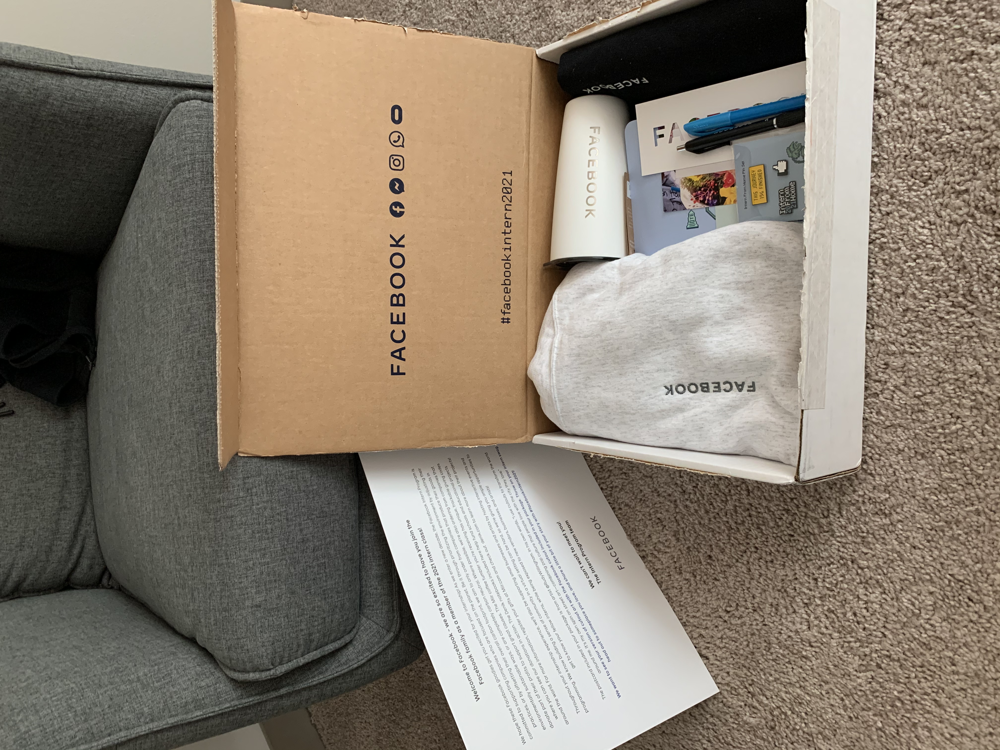

I started my journey in computer science as a freshman in college. Little did I know, this journey would take me to the heart of Silicon Valley.

In this blog post, I share my experience as a software engineer intern at Facebook. For those who are trying to gauge if Facebook is the right fit - I hope this post will provide valuable insight. For those who are on the grind for an internship - I hope this will serve as a source of inspiration to keep going. Facebook seemed like a pipe dream, but through grit and little bit of luck, I'm really happy to have made the impossible possible.

### Application Process
In tech, the greatest challenge is landing the interview itself. The competition for a software engineering gig is borderline ridiculous, with tens of thousands of students competing for only a handful of available spots. A LinkedIn resume drop or applying through a portal will only get you so far, and many times, without an interview.

My recommendation is to at least submit your application alongside a referral from a current employee of that company. For anyone applying to Facebook, I would highly recommend asking for a referral from someone who can speak to your qualities as an engineer.

However, my journey with Facebook started out a bit differently — I got lucky. A recruiter reached out to me on Piazza, a learning management site used by professors at my university, after viewing my resume. Frankly, it was the unlikeliest of all places for a Facebook recruiter to be reaching out. But it happened. I was invited to interview — although my first attempt at cracking the coding interview was unsuccessful.

Exactly a year later, in Fall 2020, I gathered the courage to contact the same recruiter and was lucky to be granted a chance to interview again. This time, I cracked both rounds of technical interviews. A couple days after the second round, I received a call from the recruiter with a formal offer to join Facebook for Summer 2021 as a software engineer intern. It felt surreal.

### Team Selection
The team selection process for interns at Facebook is done in a manner so that both parties — the interns and company — benefit from the program. Few months prior to the internship, interns are given a survey through which they can express interest in certain pillars within Facebook.

Specific teams are NOT provided as options to select from, but interns can express interest in certain fields (e.g. machine learning, frontend engineering, backend engineering, etc) and app pillars (e.g. Instagram, Facebook, Oculus, WhatsApp, Messenger, etc).

Once the surveys are submitted, a mysterious script magically performs team matching. From what I experienced and heard from others, the team matching script does a pretty great job of satisfying both parties.

I was matched with the Business Messaging Lead Gen Ads team, a business-facing ads product team. It is a product used by businesses worldwide, and at the time I was matched, I felt it was an assignment I could excel in.

### A Remote Internship
Due to the pandemic, the 2021 Summer Internship Program was fully remote. Although my team was based in Menlo Park, I chose to work from Los Angeles. It made the most sense as LA shares the same time zone, has more affordable rent, and offers a lot as a city, including outdoor hikes, beautiful beaches, and great restaurants — especially Korean ones. My roommate was also working remotely as a software engineer intern at a different tech company, so we decided to rent an Airbnb together.

Working remotely meant that Facebook shipped its tech equipment to all interns.

Facebook also sent out intern swag a few weeks before the internship!

I set up a nice home office for myself — having that ultrawide monitor was extremely helpful. 😇

### Imposter Syndrome
Imposter syndrome is defined as doubting your abilities and feeling like a fraud. I heard and read about it on countless online forums, but had never experienced it myself until my internship with Facebook. As excited as I was to work at Facebook, the thought of working at one of the world’s leading tech firms was incredibly daunting. I always had the idea that engineers working at companies like Facebook and Google were geniuses — I never thought I would belong to one of them. 
As the start date loomed, I became slightly overwhelmed. Would I be able to meet expectations at Facebook? What if it takes too long for me to learn the internal tools that are required for work? What if other engineers on the team think I don't deserve to be working with them? I spent hours reading about imposter syndrome on various tech forums online, and it offered a sense of comfort to know that many others were experiencing the same thing I was. I read a lot of advice along the lines of "There's a reason why they hired you. Believe in yourself" — but still, I wasn’t convinced.

### Ramping Up
In the blink of an eye, I started my internship. The first  days consisted of orientation and general training on source control (Facebook uses Mercurial instead of Git). Once I completed general training, I held my first official meeting with my intern manager. We spent that time getting to know each other before diving into the details of the internship. My manager prepared a very detailed document on my intern project, including general onboarding documents on our team's codebase. We also went over my goals and KPIs, ensuring all expectations were clearly communicated. This included preferred ways of receiving feedback, working hours, and more. I felt very supported by my intern manager throughout the internship, and the project was most definitely doable within the given time frame (it was well scoped out by my manager beforehand). I outlined 2 goals for myself and communicated these very clearly to my manager:

* To receive a return offer at the end of the internship
*	To get to the level where I could confidently review another team member's code and approve it (at Facebook, only one person needs to review and approve code to ship it to production.

I was assigned starter tasks that provided just the right amount of exposure to Facebook’s vast codebase. After completing the starter tasks in a few days, I moved on to tackling the intern project milestones. By this point, I felt increasingly confident that I would be able to handle the work assigned. It also helped to have a supportive team and intern manager who genuinely wanted me to succeed.

### Not Just an Intern
At Facebook, I never felt like “just an intern.” I had full access to the gigantic monorepo (yes, Facebook keeps all its code in a single repository), attended meetings with full time engineers, performed code reviews, provided feedback on our team's products, and had full control over my working schedule.

Furthermore, I worked on a full-stack project using technologies such as React for frontend and Hack/PHP for backend logic (Note: a lot of Facebook's backend code is written in Hack/PHP, especially for product teams). Although I had extensive experience with React, I never worked with Hack/PHP, but it was an easy learning curve  as it is quite similar to other programming languages I was already familiar with. As such, I finished my intern project in 7 weeks. 

For the remaining 5 weeks, I drafted a proposal for my own mini-venture to build on the project I had completed. Once I received my team’s blessings, I collaborated closely with our product designer, product manager, and content designer to bring it to life. 

That’s why what I loved about interning at Facebook was contributing to projects that impact the real world. The feature I built, for example, was highly requested by high-profile clients such as AT&T and Lexus.

### Takeaways
I learned so much during my time at Facebook. Not only that, I left Facebook a much more confident engineer. Here are some of the takeaways:
*	You don't need to be a programming prodigy to work at Facebook. You need to be self-driven and eager to learn!
*	Soft skills are extremely important for engineers. Code is merely the end product that software engineers produce, but a lot more goes into making that happen.
*	There are lots of internal tools to navigate at big tech companies like Facebook. Learning how to use them will help you become much more productive.
*	Don't take existing code for granted. Just because it passed code reviews and was merged to the main trunk does not mean that the code is failproof.
* Take advantage of the opportunity to work with senior engineers and learn from their code. Review their code and see how they write theirs differently. How would you have implemented the same thing yourself and how did they do it differently?

### Tips for Future Facebook Interns
*	Communication is key - always make sure that your intern manager is on the same page as you. Share your progress daily, and whenever you reach an important milestone, communicate your accomplishment to your team as well. Communication was the single most important factor in having completed my remote internship successfully. It makes it easier for your manager to vouch for you in the final calibration as they’ll have a solid idea of your hard work. Two peer engineers also write reviews for you in the final calibration, so make sure to also communicate with them as much as possible.
*	Don't be afraid to ask questions, especially when you are having trouble getting unblocked.
*	If you want to maximize your chance of a return offer, do yourself a favor and start working on your project as early as you can.
*	Once you receive comments on your code, act on it, and make sure to keep a checklist before submitting your code for review in the future. It's best that other engineers don't have to point out the same things over and over again.
*	Remember that an internship is a sprint, not a marathon. You only have ~10 weeks to prove that you can provide value to the team. Don't focus too much on maintaining a great work life balance during your internship - you can worry about that when you’re full-time. Make sure you stay focused on doing whatever you can to deliver your project in time!
*	Own your project. Remember that Facebook treats you as a full-time employee during your internship. If you have ideas, share it with your team. Feel free to expand on the scope of your intern project. Showing initiative is a quality they look for - so don't be shy!
*	Before asking design questions about the code you are writing, always form your own opinion first. They will be curious on what your thoughts are before they present their take on it. It's always a good idea to outline your thought process before asking for an answer.
