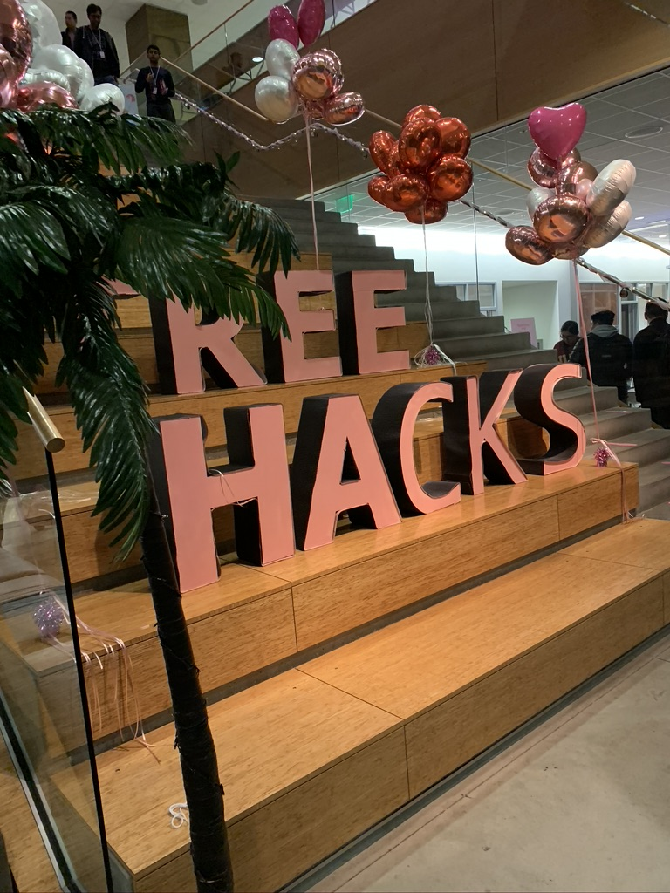

I just completed my degree in computer science at [Northwestern University](https://www.northwestern.edu). Coming into college, I hadn't written a single line of code. Not even a line of "hello world". In fact, I never saw myself majoring in a science/engineering field. Throughout my middle school and high school life, I always considered myself more gifted in things like 
public speech and debate - so naturally for me, I considered going into law, although it was more just a mere stream of thought than a decisive opinion. I came to Northwestern thinking that I'd study economics (because it seemed like the *safe* major to go with, for some reason) and international relations. 6 years and a half later (I took 2 years off due to mandatory military service in Korea and another half a year off due to COVID-19), here I am, with a degree in computer science and a full-time job at Meta (Facebook) secured. It wasn't easy, but I truly had an amazing experience at Northwestern. In this blog post, I want to jot down a few notes on how I navigated my transformative adventure into the world of computer science and technology. 

### Disclaimer 
Before we further dive into this post, I'd like to carefully just put this out there - I am an *ambitious* person. I see myself as an over-achiever, and I strive to be a better version of myself every single day. That's just who I am. At the same time, I also acknowledge that not everyone is the same. Not everyone has the same values in life, and different people live with different principles in life. I respect that. This blog post is not meant to persuade readers that they should agree with my takeaways from college life. Even more so, this blog post is not meant to intimidate prospective computer science students. I am simply reflecting on my college life as a computer science (international) student who always dreamed of starting a career as a software engineer in the U.S. after graduation. For those who are still interested in reading on, I hope this post will be helpful in navigating your own journey.

### Computer Science is Not For Everyone 
The number of computer science students grew exponentially in the past few years. As someone who has been in college since 2015, I've experienced this boom first-hand. When I first came to Northwestern, economics was by far the most popular major among undergraduates. Fast forward to 2022, computer science is one of the most popular majors, if not the most popular major. There are good reasons for this. Students seek to get a good return on their investment in college tuition, and a computer science degree can pay a handsome salary straight out of college. Let's address the elephant in the room. In 2022, fresh grads with offers from top tech companies score a $150k+ salary. Many computer science students also pursue summer internships which can pay $20k+ over a single summer. Despite the fact that most of these top-paying jobs are in high cost of living areas (e.g. SF, NYC, Seattle), there is no denying that making $150k+ a year with *zero* years of experience is fantastic by all standards and measures. Add to that the glamorous picture the media has successfully painted around the tech industry - employees playing ping pong at work with free coffee - it's no surprise we see a record number of computer science grads every year. However, as great as all this may sound, I cannot stress enough how important it is to seriously ask yourself if computer science is the right path for you before diving in head first. I can confidently say that **computer science is not for everyone.** Just a few off the top of my head: are you okay with spending 10 hours straight debugging a program? What if after 10 hours of debugging and losing sleep, you find out there was a missing semi-colon on line 37? Are you willing to spend time outside of class building projects that may never see the light of the world? Are you willing to constantly learn new technologies? These are definitely some of the experiences you will go through, if you decide to pursue a computer science degree and work in a related field. I can assure you that if you are simply in it for the money, you will get burnt out very quickly. It's *okay* not to jump on the computer science hype-train just because everyone else seems to be jumping on it. I advise you to take a few introductory computer science classes to see if it's something you'd like to continue with, before fully committing.

### School Tips

#### Tip 1: Apply Yourself While at College
Apply yourself while at college. Either you are paying for it (and you have student loans), or your parents are paying for you. Either way, going to college is a massive investment - and you should try everything you can to make the most out of it. Apply yourself in all the classes and take advantage of the resources that make colleges different from bootcamps. Try to sit in the front and pay attention to the lecture. Be curious, and be express your desire to learn. You have extremely capable professors - go talk to them. Go to office hours and form a close relationship with one or two professors. These small things can actually make a huge difference - it will open doors to research opportunities, professors will be more willing to write letters of recommendation, and some of these professors may even have personal connections to startups that you may be able to intern at. 

#### Tip 2: Utilize Free Online Resources 
The internet has certainly changed the landscape of almost every industry, and education is no exception. There are *so many* free online resources that you can take advantage of. Although it's crucial to actually go to your classes, don't be afraid to learn on your own using resources that can easily be found online. Google is your friend. Youtube is also your friend. Take advantage of them! Also, top CS schools (e.g. Stanford, MIT, Carnegie Mellon) often upload their most popular courses on Youtube for the world to learn from. If you feel like this is something that you would benefit from, go for it! I personally found some of these resources extremely helpful in cementing my understanding of certain core CS topics.

#### Tip 3: Don't Cheat
Cheating is sadly quite a serious problem in colleges. Many students face disciplinary measures of varying degree due to violation of academic integrity policies. As is the case with anything else, cheating in computer science classes won't get you anywhere. You will be unable to learn the core concepts and materials that will be crucial to learning the next thing. Once you start "borrowing" code from your peers without even understanding it, you'll find yourself falling behind quickly. It will lead to a vicious cycle of continuous cheating. In the best case, you will have graduated without getting caught - but you wouldn't have learnt anything while paying tens of thousands of dollars for your education. The worst case - you could get kicked out of school. So don't cheat. Try to actually learn the materials and go to office hours to ask questions. Consult the numerous free online resources that can help you learn outside of class. If you find yourself having to cheat over and over again in your computer science courses - this may be a good sign that you may not be the best fit for a CS degree.

#### Tip 4: Don't be Intimidated
I was very fortunate to have someone who cared about the learning environment as my very first computer science professor. It was a mandatory introductory computer science class at Northwestern - and there were students of varying coding abilities. Some students started coding at a much younger age - and there were students like me, who literally just started coding in college. The professor didn't let the more advanced students show off, and didn't let them intimidate other students by asking questions about code compilers in front of a class just learning how to write a "hello world" program. But I do acknowledge that not everyone will be lucky enough to have such a caring professor! In that case, **do not to be intimidated by students that may seem to be ahead of you.** Don't let anyone make you feel small, or inadequate. As long as you are ready to passionately learn and put in the effort required, that gap between you and the student asking about code compilers will converge to zero over the next few years in college. Also, don't feel too rushed to learn everything at once. If you are surrounded by students who seem much more advanced than you are, you may feel like you have to learn a million things at once. That will put a massive mental overhead on you. Just focus on perfectly mastering the class materials. You'll see that learning becomes a lot easier once you are better equipped to learn the more advanced concepts. So don't rush it!

#### Tip 5: Find a Mentor
Find a mentor if you can. It's best to find a mentor that can interact with you in person - but if you can't, at least find someone (e.g. Youtuber, Twitch tech streamer, etc) that you admire and respect. If you are lucky enough to find someone that you can personally interact with, you are in a great spot. What's so great about having a mentor is that they are people who have already gone through what you are currently going through in the past. They have *experience* walking down the path that you are walking through right now. So mentors can offer you invaluable advice - but remember that you have to be proactive about it. No mentor will baby-sit you. You have to make sure that you do all the hard work, and seek for guidance from the mentor as much as you can. I was fortunate to have a mentor, and I ended up getting an opportunity to intern at a startup that he founded. Mentors can also be a source of inspiration, as I looked up to him and aspired to become like him one day. 

So then the question must be, *how* do you find a mentor? There is no easy answer for this. But I'd recommend attending tech-related club events and networking events to expand your network. 
Do you have school alumns working at tech companies attending an info session? That'd be a great chance for you to get to expand your network. Go for it. Also, there can be upperclassmen in your computer science classes that may be willing to help you. Always keep an open mind, and be proactive about everything.

If you are still unable to find anyone, or are simply too shy, you could also look for tech Youtubers or Twitch tech streamers. This would be a slightly different type of mentorship, as you probably won't be interacting directly at a personal level with them. For example, I really admire the passion that [this Youtuber](https://www.youtube.com/watch?v=qKl1_dtJ2hk) shows. He shares some personal stories as well as engaging videos about his journey in mastering Vim (the text editor). I personally found it extremely helpful to have a source of inspiration that motivated to push myself and get better everyday.

#### Tip 6: Find a Hobby
It's crucial to develop a sustainable study schedule. It can be *extremely* draining to constantly have to code and be under pressure. So instead of trying to force yourself to stick to a grueling study schedule that can quickly burn you out, create a sustainable pattern that can help you finish the years-long marathon. What that hobby may be really depends on what you like to do. While video gaming and binge watching Netflix are certainly valid ones, I'd recommend that you do something more active, if possible! It's important to take care of your physical health as well. For me, I try to hit the gym almost every day, and it really helps me clear my mind.

#### Tip 7: It's Okay to Take Time Off School
For those of you that are fortunate enough to be able to take time off college, it's okay to do so! It's not a race to graduate as early as possible. But this doesn't mean that you should take time off just to rest. Try to make the most out of the time off school. I took 6 months off school to pursue an internship opportunity at a startup. While working, I could see how knowledge learned in school can be applicable in the actual industry - this got me even more motivated to take certain classes once I got back to school. Don't think of college as a 4 year race. If you are able to, it's okay to take your time. Do it your way.

#### Tip 8: Start Learning About Money & Personal Finance Earlier
Start learning about money earlier. Get a credit card and start building your credit! Especially if you have an internship secured, you should definitely start looking at investing early. Your time invested in the stock market is the single most important factor of being a successful investor in the future (if you are a *long term investor*, like me). Since software engineering internships pay quite a decent salary (ranging from $20 ~ $60+ an hour, depending on the company), you can get a head start on your investing journey. I highly recommend [The Psychology of Money](https://thecollegeinvestor.com/34999/the-psychology-of-money-review/) - it's a fantastic and easy read for people looking to gain control of their personal finance.

#### Tip 9: Explore Different Areas of Computer Science
At first, I was extremely confused at the generic term "software engineer". It seemed like to me that a person writing C code for a device driver would have a very different job than someone writing frontend javascript code to build UI. But they are all referred to as *software engineers*. Do I need to learn how to do literally *everything* from embedded systems to CSS to be hired as a software engineer? The answer is, *no*. There are many different fields of software engineering (e.g. Web Frontend, Mobile Frontend, Backend API Dev, Systems, Machine Learning, QA Engineer, Networking Engineer, etc) and you are most likely going to have to choose one or two fields that you are interested in exploring further. As an undergraduate student, you certainly do not have to feel pressured to specialize in any of these fields - simply understanding that there are many different areas of software engineering is good enough. As you go through your courses in college, try to see which classes and technologies interest you the most. Another great way of finding out about which part of the "tech stack" you would be a great fit for is to work on side projects. For example, if you are building a relatively standard web application with a separate frontend and backend, you should be able to get a feeling of what it would be like to work as a frontend engineer / backend engineer. If you decide to get more complicated with your project and add fancy bits of infrastructure to it by using AWS, docker, and many other technologies, you will also be able to get some exposure to deeper backend infrastructure work. Little by little, explore different areas of software engineering and see what you find interesting.

#### Tip 10: Get Extremely Proficient with at Least One Programming Language
Become extremely proficient with at least one programming language! You'll be surprised to see how many students graduate with a computer science degree without having a single programming language they are extremely comfortable with. The reason why you should have at least one programming language that you are extremely proficient in is very simple: it makes learning other languages *that much easier*. Different languages have different syntax, but a lot of the languages share similar concepts. As a software engineer, you will have to learn different languages fairly quickly on the job, and that becomes a lot easier if you have already mastered a language before. Another reason is because you'll have to interview to get jobs, and it really helps to be very comfortable with a specific language of your choice. It's much easier to focus on the logic of the code (i.e. the problem that you are trying to solve) if you are confident about your ability to actually write the code out in the language of your choice.

#### (Highly Opinionated) Tip 11: Learn How to Use Vim
Learn how to use VIM! I use Neovim as my primary text editor, and I personally think it has boosted my productivity. As a software developer, you'll spend a lot of time in the terminal, so I think it's great to get used to tools that live in the terminal, rather than depending on GUIs. There's a steep learning curve to learning how to use Vim, but I'd say it's totally worth it :) 

### Recruiting Tips

#### Tip 1: Think About Internships Early in College
If you are considering hopping right into the job market after graduation, the fastest & the most straightforward way of achieving that goal is through scoring internships while a student - the most important one being your junior year internship. Typically, students are able to get the "big" internships in their junior year - but there's no harm in starting early. Throw yourself out there in your freshman/sophomore year. There are internship programs from big companies like [Google STEP](https://buildyourfuture.withgoogle.com/programs/step/) and [Facebook University](https://diversity.fb.com/initiative/facebook-university/) that are specifically designed for 1st and 2nd year students. You can also apply to startups on sites like [angel.co](https://angel.co/). Don't be afraid to reach out to people on LinkedIn to ask for advice and/or potential internship opportunities. Just remember to be respectful of them. If you start thinking about internships early in your college life, you'll be well equipped come junior year when stakes are high. You'll know how recruiting works in general, you'll likely have a few recruiters that you've already established connections with, and the whole process won't feel so daunting and foreign. 

#### Tip 2: Do Side Projects
I'm sure you've already heard someone say this to you, but I'm just gonna say it again. Side projects are *extremely* important as a college student trying to break into the industry without much work experience. If you already have multiple internships under your belt, then side projects may be less important. However, for those of you that are looking for that first internship and have no proper job experience to show for, side projects are *critical*. Why? Employers want to see that they are hiring someone who can contribute without them having to spoon-feed everything. In software engineering, learning computer science theory and reading thick textbooks isn't good enough as it doesn't necessarily translate into practical skills. Side projects outside of class is a great way to bridge that gap between knowledge learned in class and practical skills required to work in the industry. For example, side projects can teach you a lot about how the Git version control software works, which is pretty much what the entire industry uses. You can also gain exposure to popular web frameworks such as React and Vue.js for frontend and Django and Express.js for backend. If you decide to get more fancy, you could also play around with various cloud computing platforms such as AWS (Amazon Web Services) and GCP (Google Cloud Platform). Knowing how to use these tools make you a *much more attractive* candidate in the job market.

As a college student, you are a part of your local community (of your peers and neighbors). As a student developer, you are in a unique position to try and solve some of the problems that are solvable through technology. For example, I built a [website](https://sublets-nu-new.herokuapp.com/) that attempts to make off-campus room search easier - an exclusive Northwestern marketplace for sublets. Although the website isn't currently actively used, I learned *a lot* while building this website with my team. I also talked about this project in every single interview. The reason why I recommend trying to solve a problem that your community uniquely has is because you can keep yourself motivated to actually finish the project. Aim to actually launch the project - it'll be a cool experience!

#### Tip 3: Write a Proper Resume 
Having a resume that is succinct and clear is incredibly important. Obviously, the more quality content you have to put on your resume, the better it is. However, writing a good resume is more than just having good content. Make sure that you have your resume formatted properly. Make sure there aren't any silly grammar mistakes. Make sure you are putting things in the form of **accomplished [x], measured by [y], by doing [z]**. I found [this guide](https://www.freecodecamp.org/news/writing-a-killer-software-engineering-resume-b11c91ef699d/) to be particularly helpful. Remember that recruiters don't look at your resume for more than a few seconds - it's up to you to create a resume that's impressive and clear enough to ensure that your resume doesn't end up in that "no pass" pile. 

#### Tip 4: Try to Contribute to Open Source Projects
Try to contribute to open source projects. Not only can you learn about how software development is actually done in larger companies (e.g. code reviews), you can also learn the basics of Git - these are extremely important skills if you actually want to be successful on the job. On top of that, contributing to open source projects (especially the more famous ones) can make your resume really stand out. If you are interested but don't know how to get started, [this](https://github.com/freeCodeCamp/how-to-contribute-to-open-source) is a great place to start.

#### Tip 5: Participate in Hackathons
To be truthful, I've only participated in one Hackathon in my college life. I wish I had gone to more. I had such a great experience at Stanford's TreeHacks - I had the chance to meet numerous like-minded people who were passionate about using technology to make the world a better place. Go to Hackathons - have fun, network, and learn a ton!

#### Tip 6: Take Advantage of Networking Events on Campus
Take advantage of on-campus networking events as much as possible. While networking may not be as important for computer science students compared to some of the other industries, it still can make the world's difference. The most difficult part of the recruiting process is often landing the interview itself. By attending on-campus networking events, you can certainly maximize the chances that you'll at least get an interview. Unlike when you apply to a company online, where your resume will be sitting with tens of thousands of other resumes, you can pass you resume directly to a campus recruiter during these events. Some companies even conduct on-campus interviews as well. Don't be shy and get yourself out there!

#### Tip 7: Don't Compare Yourself to Your Peers
Recruiting is, for most, a draining experience. There are many different reasons as why it can be mentally draining, but I think the single most unhealthy thing to do is to constantly compare yourself to your peers. If you have friends around you landing offers from top companies while you are struggling, it can be tough. You'll also see that LinkedIn explodes with posts from people who are posting their success stories - about their dream FAANG offers. It's important not to compare yourself against them. Remember to go at your own pace, and that *you only need one offer* no matter how many rejections you get. If you feel down, just take a look at [this website](https://rejected.us/), and see for yourself how much luck is involved in the process. You just need to keep going and never give up :) 

#### Tip 8: Getting Ghosted is Okay
During my first recruiting season, I applied to about 200 different companies and was ghosted by more than 100 of them. *This is normal* - especially if your resume doesn't have big name companies on it yet. Don't take it personally, and focus on the companies that do get back to you. Recruiting is a numbers game. During the recruiting season where I landed offers from Microsoft and Facebook (this was my second recruiting season), I applied to about 200 companies, heard back from 15, had final round interviews with 5, and received 2 offers.

If you read along this far, thank you! I wanted to share my experience studying computer science in the hopes of helping someone out there. Best of luck in your own journey! 
