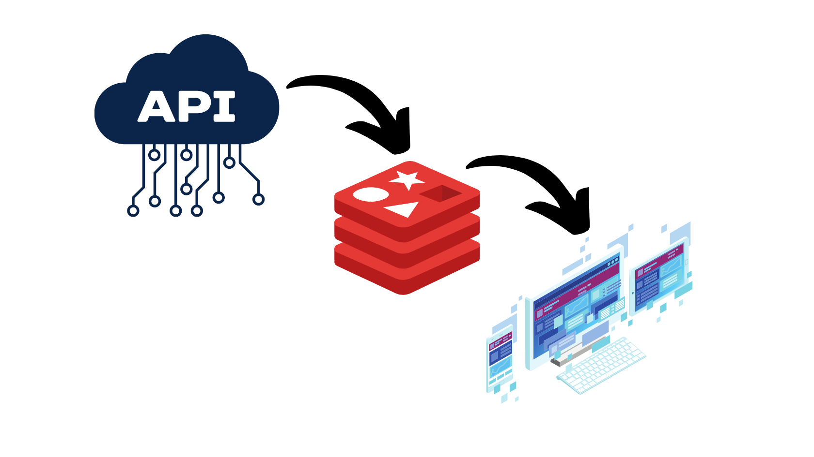
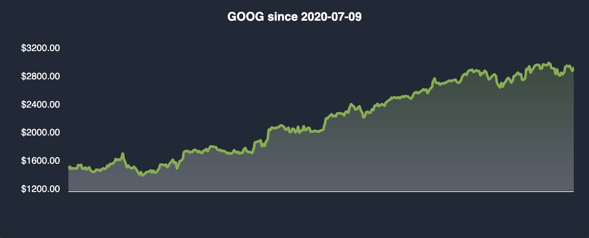
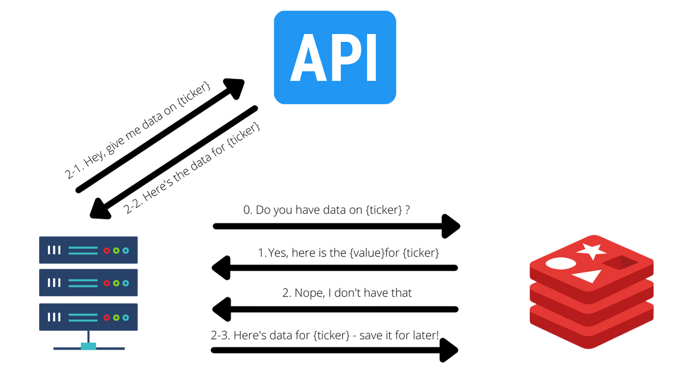
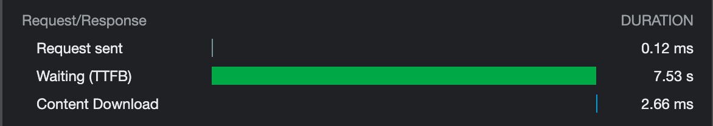
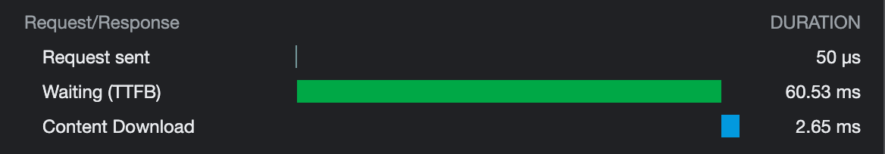

Recently, I've been working on a side project - a web application ([inretrospect.finance](https://www.inretrospect.finance)) that lets users record their investments with notes for future reference. The whole project is built on top of a fantastic API from [Alphavantage](https://www.alphavantage.co/documentation/) that provides detailed financial data on public companies. While it would have been great if it were possible to make unlimited API requests - their free tier plan only allows for 5 requests per minute and 500 requests per day. This obviously is a significant bottleneck, so I needed to find a solution. After putting some thought into this, I decided to *cache* API requests so that whenver there's a *cache hit*, a request to the actual API endpoint is not made, therefore cutting down the number of requests to the API service. With that context in mind, let's dive in.

## 1. What is Redis?

Redis (**RE**mote **DI**ctionary **S**erver) is an advanced NoSQL key-value data store that is open source (BSD license) - often used as a database, cache, and message broker. Redis is increasingly a popular choice by developers that are looking for an extremely fast and versatile data storage. While it can serve a variety of different purposes, we will focus soley on using Redis as a cache - explicitly to speed up future requests for the same data. I am by no means an expert at Redis, and in this blog post my aim is to document my process of solving a relatively simple problem I faced while building a side project - not to give a detailed technical introduction to Redis. For that, I'd recommend visiting their [official documentation](https://redis.io/documentation).

## 2. Installing Redis 

To get started, we first need to install Redis. I have a machine that runs MacOS, so please take that into consideration.

```bash
$ brew update
$ brew install redis
$ brew services start redis
$ redis-cli ping
> PONG
```
If you want to stop Redis from running in the background, simply run the following: 
```bash
$ brew services stop redis
```
That's about it - you should be able to run Redis on your machine now. For installing Redis on different operating systems such as Linux and Windows, I found [this](https://www.kindacode.com/article/how-to-install-redis-on-macos-windows-and-ubuntu/) article to be helpful.

## 3. How can Redis Help?

Before we proceed, I'd like to explain a little more about the problem I faced, and why Redis turned out to be a great option to address the problem at hand. In the web application [inretrospect.finance](https://www.inretrospect.finance), I needed historical stock market data for stocks of user's choice (US stocks). For the purposes of this application, I did not need real-time market data, but I did need the data to be updated once a day after market close. For example, if a user registered Facebook and Google as stocks of interest, I needed historical market data on both of these stocks in order to render a line chart. To help your understanding, below is a screenshot of the UI that needs such historical market data to render properly.



I obviously cannot magically pull stock market data out of nowhere - I needed to use an API that provides such market data. Now, let us think about how one might go about achieving this relatively simple task. The most naive and simple solution would be to send a request to the API endpoint whenever the UI is rendered. I used React to build the client side of the application - let us see what such an implementation would look like in code.

```javascript:title=StockCard.jsx {6-9}
  // StockCard component
  const [stockData, setStockData] = useState(null);

  const fetchData = async () => {
    // API request is made here with the ticker symbol of interest
    try {
      const response = await api(`/stockData?symbol=${tickerSymbol}`);
      setStockData[response];
    } catch (e) {
      // handle error here
      console.log(e);
    }
  };

  useEffect(() => {
    // fetch data on every render of component
    fetchData();
  }, []);
```

It's a standard API call that would occur in the `useEffect` hook of a React functional component - which updates the state upon a successful retrieval of data from the API request. This implementation *works*, but what would happen if someone had 5 stocks registered and hit the refresh button 3 times? That would be 15 API calls in the span of 5 seconds - and this is problematic in two ways. Firstly, the free tier API service that I used only supports up to 5 API calls per minute. Secondly, this naive implementation would be suboptimal in terms of user experience, since every single render of the component would need to wait for the API to return data. This is where caching can help us significantly. If we can cache the data returned by the API somewhere, we would be able to fetch data that has been requested previously right from the cache instead of waiting for the API to respond. That's *exactly* where Redis comes to the rescue!

## 3. Setting up Redis Within an Express Application

In order to handle the caching logic, I created an API endpoint that acts as a wrapper to the actual API endpoint that provides the market data. I did this using a Node.js Express application - let us see how to set up Redis within a basic and simple Express application. Since this post is not meant to be an Express tutorial, I'll assume that you already have an Express app up and running, or that you'd be able to set it up yourself (it should be rather simple). 

We first need to install Redis client that will help us interact with the Redis service that is being run in the background. Because our backend is being built in Node.js, we will need to do the following within the Express project directory:

```bash
$ npm install redis
OR
$ yarn add redis
```

The `redis` package installed will help us interact with Redis instances easily in our Node.js codebase. Let us first create a Redis client in our Express application before moving on to the actual business logic (i.e. caching API responses).

```javascript:title=server.js {17,20}
// load dotenv file for sensitive information
require("dotenv").config();

const express = require("express");
const axios = require("axios");
const redis = require("redis");
const cors = require("cors");
const app = express();

app.use(cors());

const redisPort = 6379;

let client;
if (process.env.REDIS_URL) {
  // production
  client = redis.createClient({ url: process.env.REDIS_URL });
} else {
  // dev
  client = redis.createClient({ port: redisPort });
}
```

Note that I am initializing a Redis client in two different ways - one with a specified URL and one with a specified port number. I conscioulsy made this choice because I needed to configure Redis in Heroku. In practice, these two different ways of creating a Redis client bear no difference.

Now, let us see the code that actually handles the core logic. The flow is as follows: 



With that in mind, let's take a look at the code.

```javascript:title=server.js
// implement API endpoint
app.get("/stockData", async (req, res) => {
  const tickerSymbol = req.query.symbol;
  try {
    client.get(tickerSymbol, async (err, stockData) => {
      if (stockData) {
        // cache hit --> simply return data stored in cache
        res.status(200).send({
          data: JSON.parse(stockData),
        });
      } else {
        // cache miss --> attempt API call
        try {
          const stockData = await axios.get(
            `https://www.alphavantage.co/query?function=TIME_SERIES_DAILY_ADJUSTED&symbol=${tickerSymbol}&outputsize=full&apikey=${process.env.ALPHAVANTAGE_API_KEY}`
          );
          // stringify data to store in redis cache
          const storableStockData = JSON.stringify(stockData.data);
          // store data from API in redis cache - expiration timeout 24H
          client.setex(tickerSymbol, 24 * 60 * 60, storableStockData);
          res.status(200).send({
            data: stockData.data,
          });
        } catch (err) {
          res.status(500).send({ message: "API Response Err" })
        }
      }
    });
  } catch (err) {
    res.status(500).send({ message: err.message });
  }
});
```

Relatively simple and straightforward implementation, right? Redis has an extremely friendly API and makes for a delightful developer experience. With minimal amount of code, you can bring drastic changes to the logic of your code for the better. If you want to check the Redis cache yourself, you can do the following: 

```bash
$ redis-cli
// a cache miss
127.0.0.1:6379> GET "GOOG"
(nil)
// a cache hit
127.0.0.1:6379> GET "GOOG"
<DATA SHOULD BE SHOWN>
```

Next, let us check if Redis actually helped us achieve our goals - how much faster is Redis compared to an API call over the network?

## 4. Measuring Performance with Redis Implementation

It'd be interesting to see how much of a difference Redis can make - how much faster is it with Redis? To test this, let's first try requesting data over the API that is not stored in cache.

```bash
// verify that there is no data stored
127.0.0.1:6379> GET "NFLX"
(nil)
```

Using Chrome Developer Tools, we can inspect the intricate details of networking operations. The screenshot below shows how long it took for the API request to process. "Waiting (TTFB)"  indicates total time for the sent request to get to the destination (in this case the Express backend), then for the destination to process the request, and finally for the response to traverse the networks back to the client. It took **7.5 seconds** for an API call asking for historical market data on Netflix stocks. 



Now, let us verify that data on Netflix is actually stored in our Redis cache. 

```bash
// verify that there is data stored stored
127.0.0.1:6379> GET "NFLX"
<HUGE DATA LOAD STORED AS STRING>
```

Then, let's refresh the page to initiate another call to our backend, and inspect with Chrome Developer Tools.



*Wow*. The cached response only took **60 milliseconds**. We just shaved off **99.3%** of the total response time with the Redis cache implementation. It's not only that - by caching API responses in Redis cache, I was also able to work with the Alphavantage free tier API during development (maximum of 5 requests per minute and 500 requests per day). If [inretrospective.finance](https://www.inretrospect.finance) scales up in the future, there will definitely be a need to start using the paid plans, but for now, this will do.

## Wrapping Up

What we went through today is an example of how the Redis cache can be used in a real-world project. Redis cache is so simple to use, yet so powerful. As developers, it is our responsibility to ensure that users get the best experience from the software we create - tools like Redis make our lives so much easier! I plan on writing another blog post on things I learned while building [inretrospect.finance](https://www.inretrospect.finance), so stay tuned :)