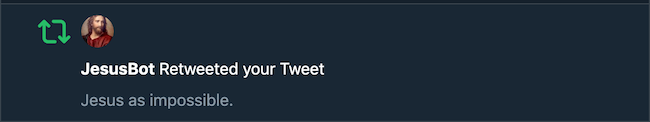

According to recent research conducted by USC and Indiana University affiliates, the *conservative* estimate for the number of Twitter bots is somewhere around 15% of all active accounts, suggesting that automated account activity is in fact prominent across the Twitter ecosystem. In fact, your daily interactions on Twitter may very well include interactions with bots! Despite the negative connotations surrounding the term *Twitter Bots*, the qualitative judgement shouldn't be so simplistic. The usage of Twitter bots can vary from being as helpful as disseminating information on natural disasters, to being as harmful as cultivating terrorist recruitment propaganda. Leaving that value judgment up to you, in this blog post, I'll be writing about how to make a fully functional Twitter bot that Tweets simple sentences composed of three words - hence the "Three Word Philosopher." Hop on!  

## 1. Getting Ready - The Basics  
As I always emphasize, when starting Python projects, it's a good idea to default to creating a Python virtual environment for the specific project that you are working on. So let's do just that:  

```console
$ mkdir my_twitter_bot
$ cd my_twitter_bot
$ python3 -m venv venv
$ source venv/bin/activate
```

Once we have our virtual environment ready, we are going to need to install some dependencies that we need for this project. For now, let us install the non-trivial dependencies that are must-haves to create a fully functioning Twitter bot. Make sure that you have your `my_twitter_bot` virtual environment activated!  

```console
$ #we are going to need BS4 for web scraping purposes
$ pip install beautifulsoup4 
$ #we need tweepy to seamlessly interact with the Twitter API 
$ pip install tweepy
$ #we need Flask to create a web app later on for user interface!
$ pip install Flask
$ #create requirements.txt containing all the dependency versions you've just installed
$ pip freeze > requirements.txt
```

We now have all the must-haves ready. Let's move on to the next step. Again, recall the order of the steps we took to start out our project here: *first* create a virtual environment, *then* install any dependencies you are going to need for the project.  

Note that in the snippet above, I've installed all major dependencies at once. However, in real life, this is unlikely to happen because you will never know which dependencies you are going to end up with at the end of the day. So in real life, it is more likely that you would update your requirements.txt file as you make progress with your project.  

## 2. Feeding Your Bot - A Wealthful and Clean Text Corpus
To build a bot that doesn't dully Tweet out same sets of hard-coded sentences over and over again, we need to first feed our bot with words so that it can dynamically generate sentences. With a bit of machine learning knowledge (such as the [Markov Chain](https://medium.com/@__amol__/markov-chains-with-python-1109663f3678)), it's possible to generate a grammatically sound sentence given that the bot is fed with a wealthful repository of words. However, for this bot, I did not use any machine learning concepts and instead opted to try and mimic a short, "philosophical" sentence by performing a simple categorization of words. To achieve any of this, we are first going to need a source for our texts. Because I wanted a long text with "philosophical" words, I scraped an e-book of John Stuart Mill's *Utilitarianism* from [Project Gutenberg](https://www.gutenberg.org/). You are more than welcome to choose any other source, but it's going to be better if the text is decently long, to prevent repetitive sentences.  

For the purposes of scraping an e-book (or any other source as long as it's online), we are going to use BeautifulSoup, Python's famous parsing library. [BeautifulSoup](https://www.crummy.com/software/BeautifulSoup/bs4/doc/) is a fantastic package for parsing HTML and XML documents. We are not looking to do anyting complex here, so the code is fairly simple. Make a python file (I named mine `scrape_words.py`), and do:  

```python
#scrape_words.py
from bs4 import BeautifulSoup
import requests

URL = "http://www.gutenberg.org/files/11224/11224-h/11224-h.htm"

#use BeautifulSoup to extract content we want from an e-book from Project Gutenberg
def fetch_text(url):
    source = requests.get(url).text
    soup = BeautifulSoup(source, 'lxml')
    text_content = ''
    for el in soup.select('p'):
        text_content += el.text 
    return text_content
```
**NOTE: Web scraping isn't illegal, but keep in mind that programs can send out requests at speeds that can have detrimental effects on the sites being scraped. It's important to adhere to web scraping [guidelines](https://www.scrapehero.com/how-to-prevent-getting-blacklisted-while-scraping/).**  

The few lines of Python code above are enough to extract the text content from the selected e-book's HTML source. Since this is not a BeautifulSoup tutorial post, I will not go into the details of using BeautifulSoup as a web scraping tool for Python (A great, free tutorial can be found [here](https://www.youtube.com/watch?v=ng2o98k983k&t=2409s), though). If you have been following along, you might have realized that the text content extracted from the HTML document tree still has some unwanted punctuations and sentences. We want to clean up that mess, or else our bot will be making sentences with unwanted words. In `scrape_words.py` add:  

```python
#scrape_words.py
import re
#text clean-up process
def text_cleanup(text):
    text = re.sub(r'\[.*?\]', '',text)
    text = re.sub(r'[^\w\d.\s]+', '', text)
    text = re.sub(r'\w*\d\w*', '', text)
    return text

output_file_write = open('gutenberg.txt', 'w')
output_file_write.write(text_cleanup(fetch_text(URL)))
output_file_write.close()
```

Essentially the function `text_cleanup` takes a string as input, gets rid of all the unwanted punctuations, and returns the cleaned up string. Then, we write that cleaned text into an output file, so our bot can later access it.  

## 3. A Simple Categorization of the Corpus
Now that we have a clean text corpus ready for use, let's write some code to help our bot generate sentences. Create a new file called `sentence.py` in your project directory, and do:  

```python
#sentence.py
import random 

def categorize():
    f = open("gutenberg.txt","r")
    contents = f.read()
    listify = contents.split()
    body = []
    start = []
    end = []
    for word in listify:
        if word[0].isupper() and not word.isupper():
            start.append(word)
        elif word.endswith(".") and not word.isupper():
            end.append(word)
        elif not word.isupper(): 
            body.append(word)

    f.close()

    return [start, end, body]
```

The `categorize()` function reads the long text from the cleaned up `gutenberg.txt` file, and categorizes it into three different lists. The `start` list is the list of words that our bot is going to select from to put as the starting word of a three-word sentence. The `end` list is the list of words that our bot is going to finish the sentence with. The `body` list contains the remaining words that are neither the starting nor ending words. To choose the words to put in the `start` list, I leveraged the fact that proper nouns and words that mark the start of any sentence are capitalized. To choose the words to put in the `end` list, I leveraged the fact that words that mark the end of any sentence are immediately followed by a period. Anything that is not in the `start` or `end` list, I threw into the `body` list.  

Although not necessarily the most sophisticated way of categorization, it will suffice for the purpose of feeding our bot with words to generate a sentence comprised of three parts - *start, body, end*.  

## 4. Make That Bot Speak!
We've finished categorizing our words, so now we need to generate a sentence for the bot to Tweet out. We are going to accomplish that by using Python's random module.  

```python
#sentence.py
def generate_sentence(start, end, rest):
    sentence = random.choice(start).replace('.', '') + ' ' \
    + random.choice(rest).lower().replace('.', '') + ' ' \
    + random.choice(end) 
    return sentence

def run():
    return generate_sentence(categorize()[0], categorize()[1], categorize()[2])
```

That's it! Now by calling the function `run()`, we can generate three-word sentences. Granted, because I didn't use a more sophisticated algorithm (perhaps a machine learning algorithm) to try and emulate a more human-like sentence, the sentences generated will not always make perfect sense. However, for the purposes of this project, it does the minimum job of sounding like a "Three Word Philosopher." Here is a sample of three-word sentences that our bot is capable of producing:  


## 5. Connecting our Bot to Twitter 
We now have a bot that can generate three-word sentences (well, something close it) by selecting words from the three categorized lists we built. To build a bot that *Tweets*, we now need to plug our bot that resides in our local machine to the outer world - Twitter.  

To connect our bot to Twitter, we first need to somehow programmatically access Twitter, right? That's where Twitter's API comes into play. API stands for *Application Programming Interface* (check this [article](https://medium.com/@perrysetgo/what-exactly-is-an-api-69f36968a41f) out), and more specifically, Twitter's API is a predefined set of Twitter-developed protocols that programmers can use to interact with Twitter at a programmatic level, without any user interface. Although Twitter's API can be used by anyone who needs it, you do need to [apply online](https://developer.twitter.com/en/apply-for-access.html) to get access to your Twitter API keys (Twitter is very sensitive to malicious usage of their API). You will need to answer some questions to confirm with Twitter that you have legitimate reasons for requesting to use their API. Once Twitter approves, you will have access to your own API keys that you will need to connect your bot to Twitter.  

Before we just copy and paste these API keys straight into our code, we need to first ask ourselves if it's a good idea to hard-code configurations. My code is also pushed up to Github, which means that other people are going to be able to see it too. *Uh-oh*. Then it would be a good idea to encapsulate our API keys with a layer of protection, so other people don't have access to sensitive information, right? Fortunately, Python's dotenv module provides a fantastic way to get around such issues. After installing the dotenv package, you will need to create a `.env` file inside your project directory and store your sensitive information there.  

```console
$ pip install python-dotenv
$ pip freeze > requirements.txt
$ touch .env
```

Then open your `.env` file with an editor of your choice, and input the following:  

```python
#.env
CONSUMER_KEY='YOUR_CONSUMER_KEY' 
CONSUMER_SECRET_KEY='YOUR_CONSUMER_SECRET_KEY'
ACCESS_KEY='YOUR_ACCESS_KEY'
ACCESS_SECRET_KEY='YOUR_SECRET_ACCESS_KEY'
```

If you are going to push your project up to a remote repository (i.e. Github), remember to include your `.env` file in your `.gitignore` file!  

Good work, now we are ready to have our bot interact with Twitter API. There are numerous ways to achieve this using Python. In this project, I chose to use [Tweepy](https://www.tweepy.org/), a very popular and easy-to-use Python library for accessing Twitter API. Create a file called `tweet_generator.py` and do:  

```python
#tweet_generator.py
from dotenv import load_dotenv
import tweepy, os

load_dotenv()

CONSUMER_KEY = os.getenv("CONSUMER_KEY")
CONSUMER_SECRET_KEY = os.getenv("CONSUMER_SECRET_KEY")
ACCESS_KEY = os.getenv("ACCESS_KEY")
ACCESS_SECRET_KEY = os.getenv("ACCESS_SECRET_KEY")

def tweet(status):
    auth = tweepy.OAuthHandler(CONSUMER_KEY, CONSUMER_SECRET_KEY)
    auth.set_access_token(ACCESS_KEY, ACCESS_SECRET_KEY)
    api = tweepy.API(auth)
    api.update_status(status)

    return status
```

The code above accomplishes the simple job of connecting our bot to Twitter through our authenticated API keys, and updating the status with a custom input - which we call *Tweeting*.  

## 6. Taking it a Bit Further - Flask and Heroku 
This is an optional part of the project that is not an integral part of the Twitter bot itself. However, I thought that it would be nice to have a user friendly interface for the "Three Word Philsopher" that I built so that people can easily use the bot that I built. I am not going to go into the details of Flask here, but as an introduction , Flask is a great Python microframework for building web applications. If you are interested, I have a more detailed post on Flask [here](https://www.jeffyang.io/blog/build_a_flask_website). Create a Python file with a name of your choice, and do the following:  

```python
#flaskapp.py
from flask import Flask, render_template, request, redirect
#we need to import sentence and tweet_generator to access the functions we wrote!
import sentence, os, tweet_generator
 
app = Flask(__name__)

@app.route('/')
def main():
    #we need a HTML file called index.html to render it
    #the sentence parameter provides the template with dynamically generated sentences
    return render_template('index.html', sentence=sentence.run())

@app.route('/tweet', methods=['POST', 'GET'])
def tweet():
    #this function will handle the tweeting 
    status = request.form['status']
    tweet_generator.tweet(status)
    return redirect('/')

if __name__ == '__main__':
    port = int(os.environ.get('PORT', 5000))
    app.run(host='0.0.0.0', port=port, debug=True)
```

You will need to create a HTML file `index.html` and put it in a directory called `templates`:  

```console
$ #inside your project directory
$ mkdir templates
$ touch index.html
```

Then open the `index.html` file in an editor of your preference: 
```HTML
<!DOCTYPE html>
<html>
<head>
    <title>Tweet Bot &#8211; Three Word Philosopher</title>
</head>
<body>
    <h5>
        <p>
            Philosopher's Tweet: "{{ sentence }}"
        </p>
    </h5>
                     
    <div>
        <form action="{{ url_for('tweet') }}" method="post">
          <input type="hidden" name="status" value="{{ sentence }}">
          <div style="display:inline-block;">
            <button type="submit">
                Tweet
            </button>   
          </div>
          <div style="display: inline-block">
            <a href="/" role="button">
                Refresh
            </a>    
          </div>
          <div class="text-center" style="display: inline-block;">
            <a href="https://twitter.com/threethouthee" role="button">
                Visit the Philosopher
            </a>
          </div>
        </form>
    </div>
</body>
</html> 
```

The HTML code above is not going to generate a decent looking interface. However, it does the bare minimum of displaying the tweets that the bot is generating through the "Refresh" button, and lets the user Tweet the generated sentence through the "Tweet" button. Again, if you are lost, you should take a look at this [post](https://www.jeffyang.io/blog/build_a_flask_website) to get a better understanding of Flask and its templating engine Jinja2. Check out my [repository](https://github.com/jeffjaehoyang/twitter_bot) to see what I did to make my interface look a bit better.  

Now that we have a Flask web application, I wanted to deploy it on Heroku so that I could reveal my bot to the world. Deploying a Flask Application on Heroku is not too difficult to do, and I have that covered in detail [here](https://www.jeffyang.io/blog/deploy_flask_app_on_heroku), if you are interested.  

## 7. What I learned
The Twitter bot project turned out to be an enjoyable learning experience. Here are some areas that I thought this project helped me hone my skills in: 

* Basic **web scraping** with Python 
* Python **regular expressions** to clean up the text corpus
* Understanding the concept of **APIs**, and how to interact with them 
* Python **configuration management** best practices
* How to **deploy** a Flask Application on Heroku 

Possible improvements: 

* This bot would have been more interesting with a machine learning oriented algorithm to generate sentences that actually sound like real human, instead of three-word sentences. 
* Twitter API allows for much more than just *Tweeting*! It would be fun to implement other functionalities to the bot, such as automated Retweeting or automated replying.  

That's all! [This](https://threewordthinker-api-heroku.herokuapp.com/) is the link to the project site that I deployed on Heroku. Thank you for reading this post, and enjoy the philosophical Tweet bot!  

*By the way*, I wasn't kidding when I said there are bots lurking around in Twitter...  



Github repository [link](https://github.com/jeffjaehoyang/twitter_bot).
