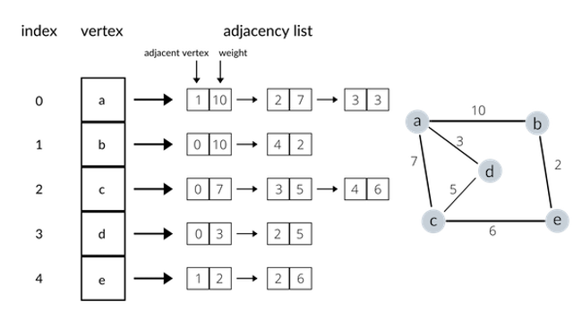
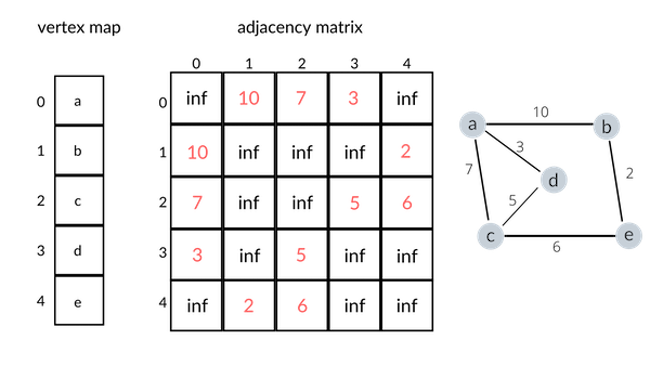

In this blog post, I will be going over the basics of the graph data structure, including its representation, implementation, and basic graph traversal algorithms. Graph is an important data structure, especially because of its practical applications that can range from representing friendships to maps of locational intelligence, computer networks and much more. Does that sound interesting? Let's dive into learning the basics of graphs.  

## 1. Introduction to Graphs
Even if you are unfamiliar with graphs, you most likely have already seen one. If you have seen or worked with *trees* before, you have already encountered a *graph* before. Let me try to explain graphs in relation to trees, a data structure that you are more likely to be familiar with, or at least more so than graphs. **All trees are graphs, but not all graphs are trees**. Like trees, graphs also have **nodes (or vertices)** and **edges** that connect the nodes, but are not bound to the restrictions that trees have. A tree is an *acyclic* and *connected* graph. A graph, however, is not limited to such restrictions; a graph can have *cycles* and can be *disconnected* to form a forest consisting of multiple components that are disconnected with another. Take a look at the following to get a rough idea of what a *directed*, *acyclic* graph looks like. 


A more mathematically oriented definition of a graph would be the following: a **graph** is a data structure that represents a **finite set of nodes (or vertices) and set of edges which connect a pair of vertices**. Confused about the technical terms (*connected*, *directed*, *acyclic*, *cyclic*, and more...) that were just thrown at you? Don't worry, that's what we'll explore in the next section.  

## 2. Categorization of Graphs
For some of you, terms such as *acyclic*, *cyclic*, *directed*, *undirected*, *connected*, *disconnected* may sound unfamiliar. Such categorization of graphs, however, are essential in deepening your understanding of graphs, and are not too difficult to get a grasp of either. To help your understanding, take a look at the following:  


As clearly depicted (on purpose) above, there are many different ways to categorize a graph. Here are some of the most important categorizations of a graph to be aware of:  

* A **connected** graph has at least one vertex and there must be a path between every pair of vertices (i.e. every vertex must be reachable by following only the edges). Otherwise, we call it a **disconnected** graph. (We won't go into the details of *strongly* connected and *weakly* connected graphs)

* A **directed** graph's edges have directions (often represented by arrows) associated to them. Otherwise, we call it an **undirected** graph.  

* A **weighted** graph's edges have associated weights or values. Otherwise, we call it an **unweighted** graph. (Weights are often used to denote a **cost** or **distance** associated with two vertices. Depending on what we are trying to represent with the graph, the weights can carry different meanings. For instance, if a graph represents a map, a weight between two vertices may denote the distance between two locations (which are represented as two distinct vertices) on the map)
* A **cyclic** graph contains at least one graph cycle. Otherwise, we call it an **acylic** graph. 

It is important to have a very clear idea on the basic categorization of graphs based on certain characteristics (as listed above). As much as I would like to provide more detailed analysis on graph and its related theory, it is impossible to cover the entirety of graph theory in this blog post (nor do I have the knowledge to do so). If interested for more information on graphs (or graph theory), I found [this](https://medium.com/basecs/a-gentle-introduction-to-graph-theory-77969829ead8) article quite helpful.  

## 3. Representation of Graphs
To dive deeper into the discussion of graphs, we need to understand how graphs are represented without having to visually draw a graph out. There are largely two different ways to represent any graph: as an *adjacency list* or as an *adjacency matrix*. 

Let us first take a look at the **adjacency list representation** of a graph. A common way of representing a graph as an adjacency list is to directly map vertices to indices of an array, and at each index of an array, represent the neighboring vertices and weights in the form of linked lists. Take a look at the following example to help your understanding: 



The diagram above shows how an undirected, weighted graph can be represented as an adjacency list. Note that using a linked list is not the only possible way to implement an adjacency list (we could use hash tables instead, and use vertices as keys and associated weights as values). 

Now let us examine the **adjacency matrix representation** of a graph. An adjacency matrix representation differs from an adjacency list in that an adjacency matrix requires a |V| × |V| matrix (where |V| denotes the number of vertices) to store information on the existence of an edge between two vertices (if the graph is unweighted) or the weight between two vertices (if the graph is weighted). A non-existant edge is usually represented by a 0 for an unweighted graph, and by "inf" (infinity) for a weighted graph. To visualize the explanation, take a look at the following adjacent matrix representation of an undirected, weighted graph: 



The diagram above should give a clear idea of how to represent a graph with an adjacency matrix. If we were to represent an unweighted graph, the "inf"s would be replaced with 0s, and all the weights (represented in red numbers) would be replaced with 1s. Now, one might ask "Which representation is better?" Well, it *depends*. If optimizing for speed, an adjacency matrix representation will guarantee an O(1) lookup time when searching for an edge between two vertices. On the other hand, an adjacency list implemented with a linked list would give O(n) time, since in the worst case, we would have to search through the entire adjacency list of vertex *a* to find that there exists an edge between, say, *a* and *f*. If we were to optimize for space, however, an adjacency list would yield a significant advantage especially when representing a *sparse* graph. An adjacency list will only store information in a linked list if there *exists* an edge between two vertices. However, as explained above, an adjacency matrix always requires a |V| × |V| matrix. Hence, if a graph is sparse (i.e. there are very few edges between vertices), the adjacency matrix will be full of default values that indicate that there is no edge between two vertices, which is quite space-inefficient.  

## 4. Traversing a Graph
Now that we have a solid idea of the graph data structure, it's time to discuss how to do a *graph walk* (or a *graph traversal* ). Knowing how to traverse a graph is extremely important, because most advanced graph algorithms (such as [Dijkstra's Algorithm](https://www.jeffyang.io/blog/dijkstras_algorithm)) use graph traversal algorithms as a fundamental cornerstone. There are largely two different approaches for traversing a graph; **depth first** and **breadth first**. A depth first traversal explores a graph until it is impossible to move further, backtracks, and continues exploring the graph in a depth-first manner until all nodes are visited. A breadth first traversal explores all the immediate neighbors first before moving on deeper into the graph, and continues exploring in a breadth-first manner until all nodes are visited. Both algorithms look quite similar, but a depth first traversal is usually implemented with a **stack**, whereas a breadth first traversal uses a **queue**. Let's take a look at the following code that implements both algorithms.

```python
import queue

def dfs(graph, start_node): 
    #this is an iterative implementation of a depth-first search
    #using an auxiliary stack data structure

    nodes = [start_node]
    visited = set()

    while len(nodes) > 0: 
        currnode = nodes.pop()
        if currnode in visited: continue
        visited.add(currnode) #mark currnode as visited
        for neighbor in graph[currnode]:
            #goes through the entire list of neighbors for currnode
            nodes.append(neighbor)

def bfs(graph, start_node): 
    #this is the breadth-first algorithm
    #uses a queue instead of a stack

    nodes = queue.Queue(maxsize=0) #queue with maxsize inf
    visited = set()

    while nodes.qsize() > 0: 
        currnode = nodes.get()
        if currnode in visited: continue
        visited.add(currnode) #mark currnode as visited
        for neighbor in graph[currnode]:
            #goes through the entire list of neighbors for currnode
            nodes.put(neighbor)
``` 

Notice how both the depth first traversal algorithm and the breadth first traversal algorithm are very similarly structured. In fact, the only difference is that the `dfs` function uses a stack (implemented with Python's list) and the `bfs` function uses a queue from the Python's `queue` module. It is also very important to **keep track of the visited nodes**, because graphs can have cycles that can lead to an infinite loop.  

## 5. Conclusion
In this post, we went through the basics of the graph data structure. This post certainly doesn't cover everything, but hopefully is enough to serve as the starting point in your journey to conquer the world of graphs. More advanced graph algorithms will likely be discussed in future posts. 


